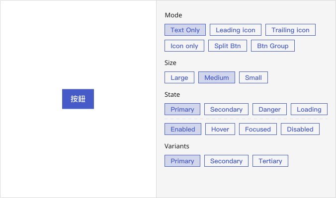
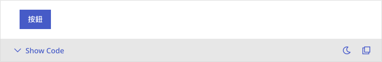
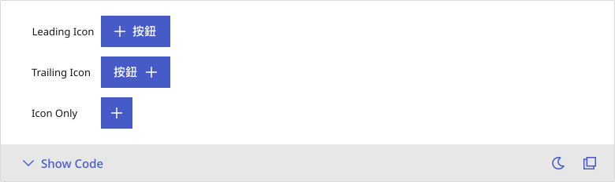
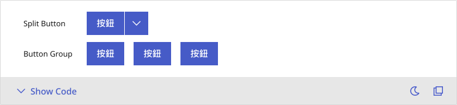
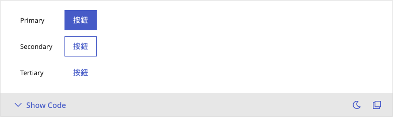
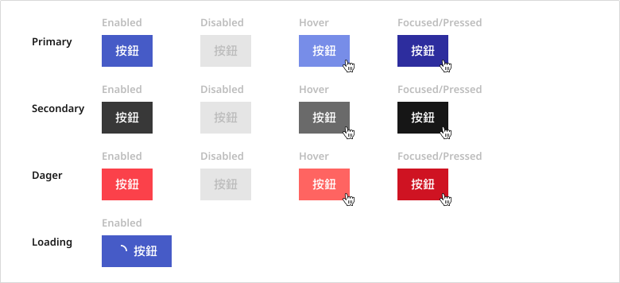
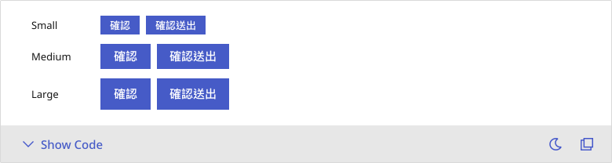

# Button
<!--Buttons enable users to initiate an action or event upon being clicked.-->
Buttons trigger actions or events in response to user clicks, guiding interaction across the interface.

## Playground

## Usage Guide
Buttons are primarily used to trigger actions, submit forms, or toggle between states. Depending on the specific context and user needs, buttons can appear in various modes—such as icon-only or split buttons—with different variants, including contained, outlined, or text-only, and states like enabled, disabled, or destructive, all to clearly communicate the intended interaction.
    ### Best Practices
	- **Choose styles based on action priority:** use Primary for main actions, Secondary for secondary options, and Tertiary for less prominent or lightweight interactions.
	- **Select the appropriate mode based on content:** utilize Icon Only, Leading Icon, Trailing Icon, or Split Button to improve clarity and flexibility.
	- **Keep label text concise and action-oriented:** start with a verb and focus on the intended task (e.g., “Save,” “Delete,” “Add”).
	- **Provide clear state feedback:** ensure consistent and intuitive visual cues for hover, focus, and disabled states.
	- **Maintain size consistency:** choose Small, Medium, or Large based on layout density to preserve visual harmony across the interface.

    ### When Not to Use
	- **For purely informational content:** use a Label or Text component instead of a button.
	- **When no real action is performed:** avoid using buttons merely for visual purposes to prevent misleading users.
	- **When combining multiple actions without distinction:** if both primary and secondary actions are needed, use a Split Button or pair with a Dropdown to clearly differentiate them.

    ### Action Flow
	1. When a user clicks the button, it triggers the associated logic—such as submitting a form, navigating to another page, expanding a menu, or opening a dialog. The button’s style (e.g., Primary or Danger) helps convey the nature of the action.
	2. After the interaction, the button may transition into different states (such as Loading or Disabled) and offer visual feedback like a press animation or color shift.
	3. For **Split Buttons**, the main button executes the primary action, while the arrow on the right reveals a dropdown menu for selecting additional options.
	4. If the button is in a `disabled` state, clicking it has no effect. In such cases, consider providing supplementary guidance—such as a tooltip explaining why the action is unavailable.

## Modes
    ### Basic
        In scenarios where the purpose of the action is singular and clearly communicated, a text-only button offers the most straightforward solution. Commonly used for form submissions, confirmation actions, or navigation switches, this style helps maintain a clean interface and reduces cognitive load on the user.

        

    ### Icon
        When visual cues are necessary to reinforce the intent of an action, buttons with icons can enhance recognition. Typical configurations include:
        - **Leading Icon:** Positioned to the left of the label, ideal for emphasizing action type (e.g., Add, Download).
	    - **Trailing Icon:** Placed on the right, often used for secondary hints (e.g., Dropdown, More options).
	    - **Icon Only:** Displays only the icon, frequently seen in toolbars, mobile interfaces, or repeated actions to conserve space.

        **📌 Note:** Icon-only buttons should always be paired with a **tooltip** to ensure clear affordance and accessibility.

        

    ### Composite
        For complex actions requiring multiple behaviors or grouped presentation, the following button types are recommended:
	    - **Split Button:** Combines a primary action with a dropdown for alternate options—ideal when a default action is available, but flexibility is also needed.
	    - **Button Group:** Aligns multiple buttons side-by-side, often used for view toggles (e.g., table/grid), filters, or multi-step actions.

        

## Appearance
    ### Anatomy
    1. **Container:** The structural frame of the button, which varies by variant. It may include a solid background, border, or transparent fill. Designed with appropriate padding, borders, and corner radius to define a clear and accessible click area.
	2. **Label:** The primary text that conveys the button’s intent. It may take the form of a verb (e.g., Submit), noun (e.g., Settings), or status (e.g., Loading…).
	3. **Icon:** An optional visual cue that can appear before (leading), after (trailing), or in place of the label (Icon Only). Icons improve recognition and help communicate action type.
	4. **Addon:** Additional UI elements for enhanced functionality in specific scenarios—such as dropdown arrows (Split Button), numeric badges, or loading spinners.

    ### Variants
    - **Primary** ( `contained` ): Designed for the most critical actions, Primary buttons carry the highest visual weight. They are ideal for submissions, confirmations, or any key operation. Typically rendered in a bold color such as blue or the brand’s primary hue.
    - **Secondary** ( `outlined` ): Used for secondary actions, these buttons are visually less prominent than Primary but still interactive. Suitable for actions like Cancel, Back, or non-critical options.
    - **Tertiary** ( `text` ): The lightest visual style—no borders or background, just text with subtle hover effects. Best used in low-disruption contexts like cards, tables, or inline actions.

    

    ### States
    We categorize button states into two major types: Interaction States and Visual Intents—enabling both designers and developers to maintain consistent semantics and styling.

        #### Visaul Intents 
        - `primary`(Blue tone): Signals a primary action. 
        - `secondary`(Neutral tones): Represents standard actions.
        - `danger`(Red tone): Indicates destructive or high-risk actions such as Delete, Remove, or Reset. Must be clearly distinguished to prevent accidental clicks.
        - `loading` : Denotes an in-progress state. Includes a spinner and disables interaction to prevent duplicate actions.

        #### Interaction States
        - **Enabled:** The default state—fully interactive and ready for user engagement.
        - `disabled` : Non-interactive and visually muted. Typically used when preconditions are unmet or permissions are restricted.
        - **Hover:** Activated on mouseover, providing immediate visual feedback to improve discoverability.
        - **Focused:** Triggered when a button is focused via keyboard navigation (e.g., Tab), enhancing accessibility.

        

    ### Sizes
    To accommodate varying interface densities and interaction requirements, three button sizes are available:
	- `"small"` : Ideal for compact areas such as toolbars, data tables, or search bars. Features reduced height, smaller typography, and smaller icons.
	- `"medium"` : The default size, suited for forms, modals, and general UI actions. Balances clickability with spatial efficiency.
	- `"large"` : Best for prominent actions—such as homepage CTAs, process navigation buttons, or full-width layouts. Offers greater visual emphasis and clearer directional guidance.
    
    
    

---

## Custom Disable
    <!-- 控制使用者在什麼條件下不能使用按鈕 -->
    Button does not support custom disabling logic; interactivity is controlled solely via the `disabled` property.

    - **Typical use cases include**
	    - Disabling the Submit button until form validation passes
	    - Preventing interaction when user permissions are insufficient or required conditions are unmet (e.g., no selection made, terms not agreed to).
	    - Avoiding repeated actions during background data processing by combining `loading` state with `disabled`.

    - **Interaction Tips**
	    - When a button is `disabled` due to unmet conditions, always provide contextual guidance (e.g., a tooltip or inline message) to help users understand why the action is unavailable.
        - Avoid hiding the button entirely—unless the condition is extremely clear—to maintain a consistent and predictable interaction flow.

## Validation / Restrictions
    To ensure that button-triggered actions occur at the appropriate time, it’s essential to define clear conditions and restrictions around their usage.\
    These measures help prevent accidental operations, double submissions, and unauthorized access, thereby improving system stability and user confidence.\
    \
    The table below outlines common validation items for **Buttons**, along with the primary responsibility of Designers and Developers:
    | Item | Description | 🎨 Designer | 🛠️ Developer |
    |-------|-------|-------|-------|
    | **Required Condition** | Only enable the button when predefined criteria are met (e.g, form validation). | Clearly indicate why the button is disabled, e.g., through tooltips or helper text. | Implement conditional logic to toggle `disabled` state based on form or process status. |
    | **Loading State** | Prevent interaction while an action is being processed (e.g., after clicking Submit). | Provide clear loading feedback such as a spinner or text label. | Block repeated clicks during loading and display visual feedback. |
    | **Prevent Multiple Submission** | Avoid multiple trigger attempts within a short timeframe. | Offer immediate feedback so users know the action is being processed. | Use throttling, debouncing, or internal locking to prevent duplicate requests. |
    | **Access Control** | Restrict actions based on user roles or conditions. | Visually reflect permission restrictions—hide or disable unauthorized actions. | Enforce permission checks on both frontend and backend. |
    | **Confirmation** | Some actions require user confirmation (e.g., Delete or Reset). | Include visual indicators or confirmation dialogs to reduce accidental actions. | Implement safeguards like modals or confirmation prompts before critical actions. |

    
## Integration
    <!-- 元件「如何與其他應用層、框架、資料結構或函式庫協同工作」的方式 = 怎麼接進系統 -->
    ### Behavior Delegation
        The component does not include built-in logic for API calls or form validation. Please handle the following integration aspects externally:
        | Action | Description |
        |-------|-------|
        | **Loading State** | Prevent duplicate submissions by externally managing the loading spinner and disabling interactions accordingly. |
        | **API Integration** | In asynchronous flows, listen for success or failure responses to reset the button state and deliver relevant user feedback. |
        | **Form Handling** | When used with type="submit", ensure it’s embedded within a parent form component. Control the disabled state as needed based on form validation. |
        | **Routing Integration** | For navigational purposes, replace with a Link component and ensure seamless SPA transition behavior. |

        

    <!-- ### Loading and API Interaction Management
    Buttons are frequently used to trigger form submissions, API requests, or data updates. In such cases, it is essential to manage loading states, asynchronous behavior, and prevent duplicate actions.

        #### 🎨 Design Considerations:
        - Should the button display a **loading spinner**, especially for Primary actions?
        - Should the button become **non-interactive** during loading, or remain clickable?
        - Will there be **success or error feedback** (e.g., toast messages, alerts)?

        #### 🛠️ Development Requirements:
        - Manage and synchronize `loading` state with UI updates.
        - Prevent repeated clicks during pending requests (debounce/resend protection)
        - Handle API responses to restore button state, display messages, or report errors.

    ### Defining Form Interaction Roles
    Buttons are often paired with form elements for submission, reset, or triggering custom logic. Each button’s role must be explicitly defined using attributes like type="submit", type="reset", or via custom event handlers.

        #### 🎨 Design Considerations:
        - Is the button intended as a **primary action** (Submit), **secondary behavior** (Reset), or an **independent trigger**?
        - How should the button's **visual state** reflect different form statuses (e.g., incomplete, error, disabled)?
        
        #### 🛠️ Development Requirements:
        - Use the correct type attribute (submit, reset, or button).
        - Ensure validation logic disables the submit button or prevents unintended form submission.

    ### Routing and Navigation Integration
    Some buttons serve purely as navigation triggers (e.g., “View More”, “Go Back”). In such cases, they should integrate with frontend routing systems (like React Router or Next.js) to provide seamless, reload-free transitions.

        #### 🎨 Design Considerations:
	    - Should navigation buttons use a different **visual style** (e.g., Tertiary for minimal emphasis)?
	    - Avoid mixing navigation buttons with action buttons—**icon + label combinations** help clarify intent.

        #### 🛠️ Development Requirements:
	    - Use framework-specific Link components (e.g., Next.js Link, React Router Link).
	    - Ensure transitions preserve SPA behavior without full-page reloads. -->

## Props Overview
    <!-- Appearance 控制外型、Behavior 控制互動行為、Data 資料處理、Validation 驗證相關、Events 事件回呼、Integration 整合支援 --> 
    ### Appearance
        Manages the visual presentation and layout of the button, including size, variant, icon placement, and color schemes. These settings ensure consistency with the design system and maintain visual hierarchy across the interface.

        | Property | Description | Type | Default |
        |-------|-------|-------|-------|
        | **color** (Button, IconButton) | The color name provided by palette. | `"primary"` `"secondary"` | `"'primary'"` |
        | **color** (ButtonGroup) | If the `color` of a button inside group not provided, the `color` of group will override it. | `"primary"` `"secondary"` | `"'primary'"` |
        | **variant** (Button, IconButton) | The variant of button. | `"text"` `"contained"` `"outlined"` | `"'text'"` |
        | **variant** (ButtonGroup) | If the `variant` of a button inside group not provided, the `variant` of group will override it. | `"text"` `"contained"` `"outlined"` | `"'text'"` |
        | **size** (Button, IconButton) | The size of button. | `"small"` `"medium"` `"large"` | `"'medium'"` |
        | **size** (ButtonGroup) | If the `size` of a button inside group not provided, the `size` of group will override it. | `"small"` `"medium"` `"large"` | `"'medium'"` |
        | **prefix** (Button) | The element placed on the start of button. | `ReactNode` | - |
        | **suffix** (Button) | The element placed on the end of button. | `ReactNode` | - |
        | **component** (Button, IconButton) | Override the component used to render. | `ButtonComponent` | - |
        | **spacing** (ButtonGroup) | The spacing level of button gap between each buttons. Will be added on if `attached`=`false`. | `number` | `small:3,others:4` |
        | **orientation** (ButtonGroup) | The orientation of button group. | `"horizontal"` `"vertical"` | `"horizontal"` |
        

    ### Behavior
        Controls the interactive behavior of the button, such as handling loading states, disabling interactions, and toggling danger styles. These props define how the button responds under different user interactions and system states.
        
        | Property | Description | Type | Default |
        |-------|-------|-------|-------|
        | **disabled** (Button, IconButton) | If `true`, button will be disabled. | `boolean` | `false` |
        | **disabled** (ButtonGroup) | If the `disabled` of a button inside group not provided, the `disabled` of group will override it. | `boolean` | `false` |
        | **loading** (Button, IconButton) | If `true`, replace the original icon. Replace suffix if only suffix provided, or prefix. | `boolean` | `false` |
        | **danger** (Button, IconButton) | If `true`, will use error color instead of color from props. | `boolean` | `false` |
        | **danger** (ButtonGroup) | If the `danger` of a button inside group not provided, the `danger` of group will override it. | `boolean` | `false` |
        | **attached** (ButtonGroup) | If `true`, all buttons will not have spacing between each others. | `boolean` | `false` |
        | **fullWidth** (ButtonGroup) | If `true`, set width: 100%. | `boolean` | `false` |

        
    ### Data
        Handles data structure and content within the button, including icon components or children elements. Ensures that the button displays the correct content, and aligns with functional roles such as form submission or navigation.

        | Property | Description | Type | Default |
        |-------|-------|-------|-------|
        | **children*** (ButtonGroup) | Only accept button elements or icon button elements. | `ButtonGroupChild, ButtonGroupChild[]` | - |
        | **children** (IconButton) | The icon element. | `ReactNode` | - |

    ### Validation
         <!--Defines the constraints or restrictions that ensure buttons are used correctly within their context—for example, requiring confirmation before enabling, or disabling buttons when preconditions are unmet. This helps prevent unintended actions and promotes form-level validation integrity. -->
        *Button does not have built-in validation logic. Input validation is typically handled by form-related components (e.g., inputs, form handlers) and not by the button itself.*

    ### Events
        <!--Handles how the button responds to user actions such as clicks or form submissions. While not configured via dedicated props in most cases, these interactions are critical for triggering downstream logic like API calls, modal toggling, or form behaviors. -->
        *While the onClick event is a core part of button functionality, it is considered a standard DOM interaction rather than a custom event prop defined by the component. Therefore, event handling is implemented externally and not exposed as a categorized custom prop.*

    ### Integration
        <!--Covers how the button connects with broader application logic—such as routing, form libraries, or asynchronous workflows. These integrations ensure the button functions seamlessly within diverse frameworks and data flows. -->
        *Button does not define integration-specific props. Instead, it can be flexibly composed with other UI elements (e.g., icons, tooltips, loaders) by nesting or wrapping, depending on the use case.*