# DateTimePicker
DatePicker allows users to select a date or a range of dates and times.

## Playground
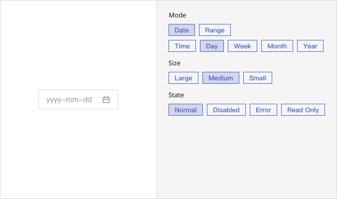

## Usage Guide
The Datepicker is typically used for selecting either a single date or a date range, such as choosing a scheduled event date or setting a date filter range.

### Best Practices
    - Prioritize use in **time-sensitive scenarios** (e.g., behavior tracking, bookings, or scheduling).
	- When selecting a range, enhance **clarity with visual cues** such as highlighting the selected span.
	- Provide sensible **default values** (e.g., the current date/time) to minimize user effort.
	- Use placeholders to indicate the **expected format**—especially important in multilingual environments.
	- The greater the time precision required, the more clearly its **necessity should be communicated** (e.g., why is second-level accuracy needed?).

### When not to use
    - When only a simple date string input is needed (e.g., year-month-day) and interactive selection offers no added value—use a **text field** instead.
	- For **filtering purposes**, relative range pickers (e.g., “Last 7 Days”) are often more intuitive.
	- When the date is **static or purely informational**, use a non-interactive label rather than an input component.

### Action
	1.	Click the input field.
	2.	A calendar appears—navigate through months and years, select a date or time, or manually enter a date following the specified format.
	3.	The selected date is displayed in the input field.
    4. Click the close icon to clear the selected date.

    #### Select Demo
    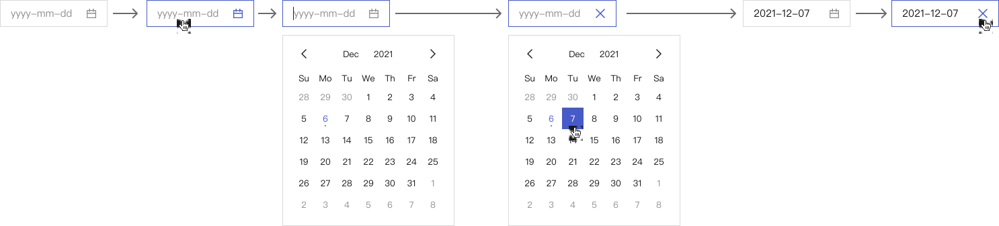

    #### Input Demo
    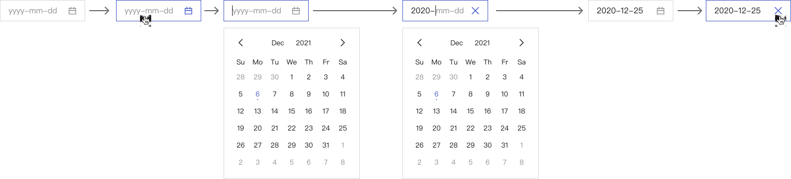

## Modes
    ### Basic
        Certain business scenarios call for date selection based on broader time units—day, week, month, or year. For instance, selecting a month for a report or defining annual goals often doesn’t require precision down to the exact day. In these cases, emphasizing higher-level time units enhances both operational efficiency and user accuracy.

        

    ### Time
        When users need to specify a precise point in time, different levels of granularity may be required. Setting an alarm may only need the hour, while scheduling meetings typically demands minute-level accuracy, and server tasks might require second-level precision. Adjusting time granularity to suit the context ensures flexibility without overcomplicating the user experience.

        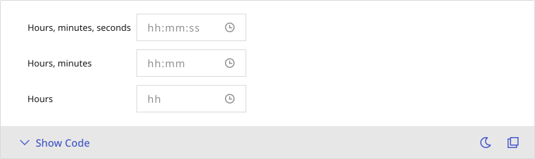

    ### Range
        For use cases involving time spans—such as leave periods, event durations, or recurring reports—a range selection is essential. The appropriate unit (date, week, month, or year) should align with the specific context. Each range mode must also ensure logical consistency between start and end points, while maintaining intuitive user interactions.

        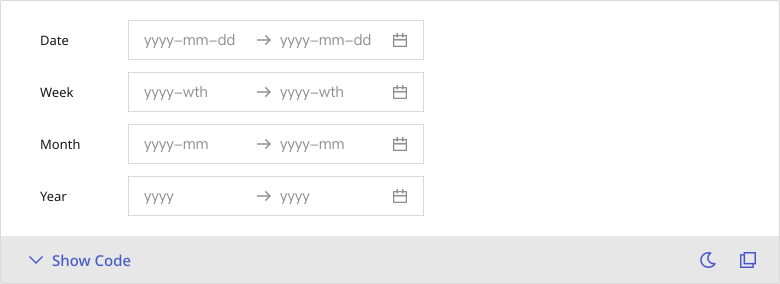
     
## Appearance

    ### Anatomy
    1. **Date & Time Field:** A single entry point for date or time input, supporting both typing and clicking interactions.
    2. **Range Field:** Displays both **start** and **end** inputs, suitable for selecting time intervals such as leave periods or report queries.
    3. **DatePicker Calendar:** Visually presents selectable dates, with features like month/year navigation and a shortcut to today.
    4. **TimePicker Menu:** When time input is enabled, this dropdown offers options down to the hour, minute, and second.
    5. **Range Calendar:** Displays a dual-calendar view, allowing users to visualize the full time range in one glance, minimizing confusion.

    ### States
    DatePicker supports four distinct states, in addition to the **Normal** state:
	- `disabled` : Non-interactive, commonly used for fields that are conditionally unavailable.
	- `error` : Clearly indicates a validation error within a form.
	- `readOnly` : Viewable but not editable, such as in applications under review.

    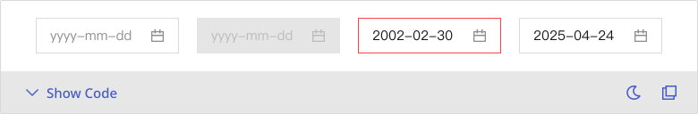

    ### Sizes
    Datepicker comes in three sizes:
	- `"small"` : Ideal for high-density layouts such as toolbars or search bars.
	- `"medium"` : The **default size** for forms and the most commonly used.
	- `"large"` : Best suited for scenarios that require emphasis or advanced interactions, such as a calendar setup in a modal.

    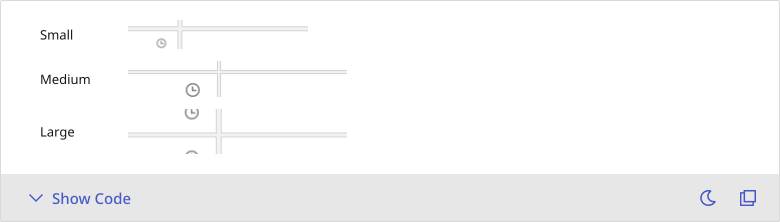
    

---

## Custom Disable
    <!-- 控制使用者在什麼條件下不能選某些日期或時間，通常牽涉到業務邏輯判斷 + callback 函式設定 -->
    This feature defines non-selectable date ranges, including scenarios such as:
	- Excluding holidays (automatically disables weekends and national holidays)
	- Disallowing past dates (for future event planning)
	- Dynamically restricting dates based on business logic (e.g., preventing duplicate bookings)

    You can configure custom rules to disable specific dates based on various conditions. Below are some common examples:
    ### Basic
    1. **mode** = `"day"`
        >**disabledMonthSwitch**, **disabledYearSwitch**, **disableOnNext**, **disableOnPrev** = `true`
    
    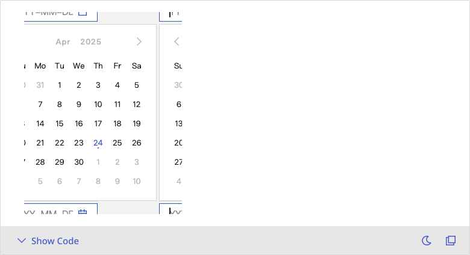

    2. **mode** = `"day"`  
        >Disabled Years: 2005 ~ 2024\
        Disabled Months: 2024-11 ~ 2025-03\
        Disabled Dates: 2025-04-27 ~ 2025-05-01

    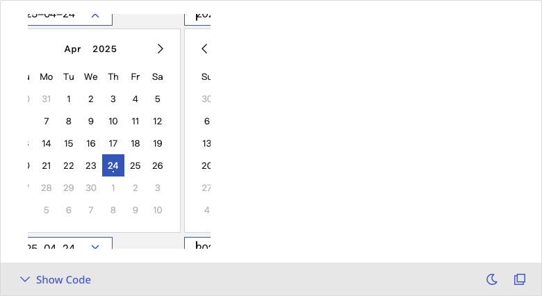

    3. **mode** = `"week"`  
        >Disabled Years: 2005 ~ 2024\
        Disabled Months: 2024-11 ~ 2025-03\
        Disabled Weeks: 2025-12th ~ 2025-15th

    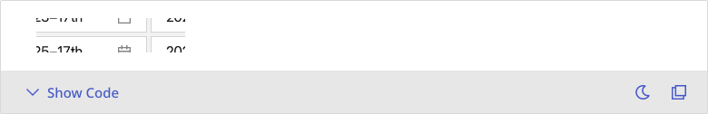

    4. **mode** = `"day"`  
        >Disabled Dates: 2025-04-27 ~ 2025-05-01

    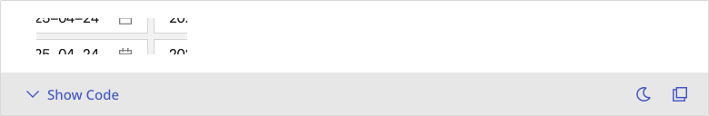

    5. **mode** = `"month"`  
        >Disabled Months: 2024-11 ~ 2025-03

    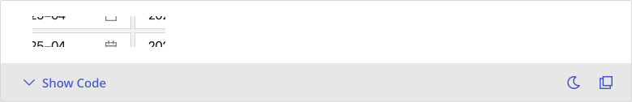

    6. **mode** = `"year"`  
        >Disabled Years: 2005 ~ 2024

    

    ### Time
    1. **mode** = `"day"`
        >**disabledMonthSwitch**, **disabledYearSwitch**, **disableOnNext**, **disableOnPrev** = `true`
    
    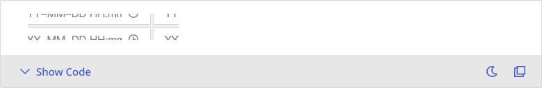

    2. **mode** = `"day"`  
        >Disabled Years: 2005 ~ 2024\
        Months: 2024-11 ~ 2025-03\ 
        Dates: 2025-04-27 17:51:23 ~ 2025-05-01 17:51:23

    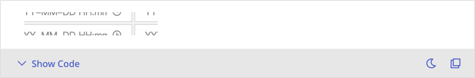

    ### Range
    1. **mode** = `"day"`
        >**disabledMonthSwitch**, **disabledYearSwitch**, **disableOnNext**, **disableOnPrev** = `true`
    
    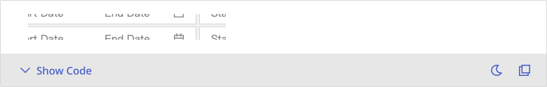

    2. **mode** = `"day"`  
        >Disabled Years: 2005 ~ 2024\
        Disabled Months: 2024-11 ~ 2025-03\
        Disabled Dates: 2025-04-27 ~ 2025-05-01

    

    3. **mode** = `"week"`  
        >Disabled Years: 2005 ~ 2024\
        Disabled Months: 2024-11 ~ 2025-03\
        Disabled Weeks: 2025-12th ~ 2025-15th

    

    4. **mode** = `"day"`  
        >Disabled Dates: 2025-04-27 ~ 2025-05-01

    

    5. **mode** = `"month"`  
        >Disabled Months: 2024-11 ~ 2025-03

    

    6. **mode** = `"year"`  
        >Disabled Years: 2005 ~ 2024

    

    
## Integration
     <!-- 元件「如何與其他應用層、框架、資料結構或函式庫協同工作」的方式 = 怎麼接進系統 --> 
    ### Date Library
        <!-- 元件底層使用哪個日期函式庫（Moment、Dayjs、Luxon 等）來處理時間格式、加減時間、判斷區間--> 
        Different projects or teams may rely on different date libraries, such as **Moment.js**, **Dayjs**, or **Luxon**. These choices influence how the component processes dates and times. To accommodate this, the component design should remain flexible, allowing for easy integration with various libraries and ensuring smooth collaboration with engineering teams.

     ### Formatting
        <!-- 要控制 UI 顯示格式、要把資料送出給後端／儲存在資料庫，格式需要一致、多語系（不同 locale）時會有顯示差異 -->
        Date formats vary across regions and services—such as `YYYY/MM/DD` or `DD-MM-YYYY` —and may include preferences like displaying time in `AM` / `PM` format. These variations require a clear separation between the presentation layer and internal data storage to ensure consistency and adaptability.

## Caution
    ### Pool/Range (min/max)
        In certain scenarios, the selectable date range may be restricted—for instance, a registration deadline that must not exceed a specific date, or allowing selection only from the current day onward. By configuring `minDate` and `maxDate` , users are guided to select within valid boundaries, reducing input errors and enhancing data integrity.