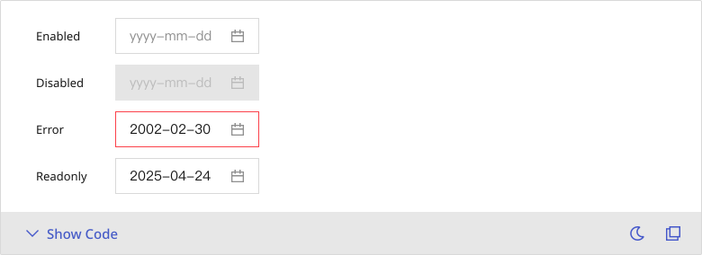

# DateTimePicker
DatePicker allows users to select a date or a range of dates and times.

## Playground

## Usage Guide
The Datepicker is typically used for selecting either a single date or a date range, such as choosing a scheduled event date or setting a date filter range.

### Best Practices
    - Prioritize use in **time-sensitive scenarios** (e.g., behavior tracking, bookings, or scheduling).
	- When selecting a range, enhance **clarity with visual cues** such as highlighting the selected span.
	- Provide sensible **default values** (e.g., the current date/time) to minimize user effort.
	- Use placeholders to indicate the **expected format**—especially important in multilingual environments.
	- The greater the time precision required, the more clearly its **necessity should be communicated** (e.g., why is second-level accuracy needed?).

### When not to use
    - When only a simple date string input is needed (e.g., year-month-day) and interactive selection offers no added value—use a **text field** instead.
	- For **filtering purposes**, relative range pickers (e.g., “Last 7 Days”) are often more intuitive.
	- When the date is **static or purely informational**, use a non-interactive label rather than an input component.

### Action
	1.	Click the input field.
	2.	A calendar appears—navigate through months and years, select a date or time, or manually enter a date following the specified format.
	3.	The selected date is displayed in the input field.
    4. Click the close icon to clear the selected date.

    #### Select Demo
    

    #### Input Demo
    

## Modes
    ### Basic
        Certain business scenarios call for date selection based on broader time units—day, week, month, or year. For instance, selecting a month for a report or defining annual goals often doesn’t require precision down to the exact day. In these cases, emphasizing higher-level time units enhances both operational efficiency and user accuracy.

        

    ### Time
        When users need to specify a precise point in time, different levels of granularity may be required. Setting an alarm may only need the hour, while scheduling meetings typically demands minute-level accuracy, and server tasks might require second-level precision. Adjusting time granularity to suit the context ensures flexibility without overcomplicating the user experience.

        

    ### Range
        For use cases involving time spans—such as leave periods, event durations, or recurring reports—a range selection is essential. The appropriate unit (date, week, month, or year) should align with the specific context. Each range mode must also ensure logical consistency between start and end points, while maintaining intuitive user interactions.

        
     
## Appearance

    ### Anatomy
    1. **Date & Time Field:** A single entry point for date or time input, supporting both typing and clicking interactions.
    2. **Range Field:** Displays both **start** and **end** inputs, suitable for selecting time intervals such as leave periods or report queries.
    3. **DatePicker Calendar:** Visually presents selectable dates, with features like month/year navigation and a shortcut to today.
    4. **TimePicker Menu:** When time input is enabled, this dropdown offers options down to the hour, minute, and second.
    5. **Range Calendar:** Displays a dual-calendar view, allowing users to visualize the full time range in one glance, minimizing confusion.

    ### States
    DatePicker supports four distinct states, in addition to the **Normal** state:
	- `disabled` : Non-interactive, commonly used for fields that are conditionally unavailable.
	- `error` : Clearly indicates a validation error within a form.
	- `readOnly` : Viewable but not editable, such as in applications under review.

    

    ### Sizes
    Datepicker comes in three sizes:
	- `"small"` : Ideal for high-density layouts such as toolbars or search bars.
	- `"medium"` : The **default size** for forms and the most commonly used.
	- `"large"` : Best suited for scenarios that require emphasis or advanced interactions, such as a calendar setup in a modal.

    
    

---

## Custom Disable
    <!-- 控制使用者在什麼條件下不能選某些日期或時間，通常牽涉到業務邏輯判斷 + callback 函式設定 -->
    This feature defines non-selectable date ranges, including scenarios such as:
	- Excluding holidays (automatically disables weekends and national holidays)
	- Disallowing past dates (for future event planning)
	- Dynamically restricting dates based on business logic (e.g., preventing duplicate bookings)

    You can configure custom rules to disable specific dates based on various conditions. Below are examples for different selection modes (**Basic, Time, Range**):
    ### Basic
    1. **mode** = `"day"`
        >**disabledMonthSwitch**, **disabledYearSwitch**, **disableOnNext**, **disableOnPrev** = `true`
    
    2. **mode** = `"day"`  
        >Disabled Years: 2005 ~ 2024\
        Disabled Months: 2024-11 ~ 2025-03\
        Disabled Dates: 2025-04-27 ~ 2025-05-01

    3. **mode** = `"week"`  
        >Disabled Years: 2005 ~ 2024\
        Disabled Months: 2024-11 ~ 2025-03\
        Disabled Weeks: 2025-12th ~ 2025-15th

    4. **mode** = `"day"`  
        >Disabled Dates: 2025-04-27 ~ 2025-05-01

    5. **mode** = `"month"`  
        >Disabled Months: 2024-11 ~ 2025-03

    6. **mode** = `"year"`  
        >Disabled Years: 2005 ~ 2024
    
    

    ### Time
    1. **mode** = `"day"`
        >**disabledMonthSwitch**, **disabledYearSwitch**, **disableOnNext**, **disableOnPrev** = `true`
    
    2. **mode** = `"day"`  
        >Disabled Years: 2005 ~ 2024\
        Months: 2024-11 ~ 2025-03\ 
        Dates: 2025-04-27 17:51:23 ~ 2025-05-01 17:51:23

    

    ### Range
    1. **mode** = `"day"`
        >**disabledMonthSwitch**, **disabledYearSwitch**, **disableOnNext**, **disableOnPrev** = `true`
    
    2. **mode** = `"day"`  
        >Disabled Years: 2005 ~ 2024\
        Disabled Months: 2024-11 ~ 2025-03\
        Disabled Dates: 2025-04-27 ~ 2025-05-01

    3. **mode** = `"week"`  
        >Disabled Years: 2005 ~ 2024\
        Disabled Months: 2024-11 ~ 2025-03\
        Disabled Weeks: 2025-12th ~ 2025-15th

    4. **mode** = `"day"`  
        >Disabled Dates: 2025-04-27 ~ 2025-05-01

    5. **mode** = `"month"`  
        >Disabled Months: 2024-11 ~ 2025-03

    6. **mode** = `"year"`  
        >Disabled Years: 2005 ~ 2024
    
    

## Validation / Restrictions
    To ensure the accuracy and stability of data entered through the component, it is essential to design and implement a comprehensive set of validation and restriction rules.\
    These checks help prevent users from entering incorrect data, selecting invalid ranges, and ensure that submitted information adheres to the expected format and logical standards.\
    \
    The table below outlines common validation items for the **Datepicker**, along with their primary audience (Designer / Developer):
    | Item | Desctription | Designer | Developer |
    |-------|-------|-------|-------|
    | **Required** | Ensure input fields cannot be left blank. | Identify scenarios that require a "required: indicator (e.g., an asterish * or descriptive text.) | Implement field validation to ensure no input is left blank, and provide clear error messaging when validation fails. |
    | **Format Validation** | Enforce YYYY/MM/DD format compliance. Differentiate between UI display format and backend data format. | Design the display format to align with regional or product-specific standards. | Ensure consistent, correct formatting during submission, storage, and validation. |
    | **Range Validation (Min/Max)** | Start date must precede end date and set logical ranges. | Visually guide users by highlighting valid selectable ranges or disabling invalid areas. | Programmatically enforce chronological order between start and end dates to prevent invalid submissions. |
    | **Disabled Date Validation** | Disable specific dates or periods (e.g., Holidays, Past Dates). | Clearly indicate disabled dates in the UI through styling (e.g., greying out or disabling selection). | Implement backend logic to block invalid selections or inputs. |
    | **Timezone Handling** | Timezone considerations for global products. | Include clear timezone indicators according to target market needs. | Accurately convert between user timezone for both storage and display to prevent discrepancies. |
    | **Prevent Invalid Input** | Prohibit invalid date inputs (e.g., Disallowed months or years) | Design the interface to restrict invalid navigation or input actions. | Block illegal entries and provide explicit, user-friendly error feedback. |

    
## Integration
     <!-- 元件「如何與其他應用層、框架、資料結構或函式庫協同工作」的方式 = 怎麼接進系統 -->
    ### Date Library
        <!-- 元件底層使用哪個日期函式庫（Moment、Dayjs、Luxon 等）來處理時間格式、加減時間、判斷區間 --> 
        Different projects or teams may rely on different date libraries, such as **Moment.js**, **Dayjs**, or **Luxon**. These choices influence how the component processes dates and times. To accommodate this, the component design should remain flexible, allowing for easy integration with various libraries and ensuring smooth collaboration with engineering teams.

    ### Formatting
        <!-- 要控制 UI 顯示格式、要把資料送出給後端／儲存在資料庫，格式需要一致、多語系（不同 locale）時會有顯示差異 -->
        Date formats vary across regions and services—such as `YYYY/MM/DD` or `DD-MM-YYYY` —and may include preferences like displaying time in `AM` / `PM` format. These variations require a clear separation between the presentation layer and internal data storage to ensure consistency and adaptability.

    <!-- ### Timezone Handling -->
        <!-- 如果要支援跨時區（例如伺服器是 UTC，使用者端是本地時間），需要說明怎麼處裏時差問題。 -->

    <!-- ### Locale Support -->
        <!-- 多語系支援（例如 en-US vs zh-TW），可能影響日期名稱、星期起始日（Monday or Sunday）等等。 -->

## Props Overview
     <!-- Appearance 控制外型、Behavior 控制互動行為、Data 資料處理、Validation 驗證相關、Events 事件回呼、Integration 整合支援 --> 
    ### Appearance
        Manages the visual presentation and layout of the component, including size, icons, the visibility of the clear button, and disabled states, ensuring alignment with the overarching design system standards.
        | Property | Description | Type | Default |
        |-------|-------|-------|-------|
        | **className** | Control the visual styling of the component. | `string` | - |
        | **prefix** | The prefix addon of the field. | `ReactNode` | - |
        | **size** | The size of field. | `"small"` `"medium"` `"large"` | `"medium"` |
        | **clearable** | Whether to show the clear button. | `boolean` | `false` |
        | **error** | Whether the field is error. | `boolean` | `false` |
        | **fullWidth** | If `true`, set width: 100%. | `boolean` | `false` |
        | **placeholder** | Placeholder for the input element. | `string` | - |
        | **confirmText** (DateTimePicker) | Display name of the confirm button. | `ReactNode` | `'OK'` |
        | **hourPrefix** (DateTimePicker) | The hours column prefix. | `ReactNode` | `'Hrs'` |
        | **minutePrefix** (DateTimePicker) | The minutes column prefix. | `ReactNode` | `'Min'` |
        | **secondPrefix** (DateTimePicker) | The seconds column prefix. | `ReactNode` | `'Sec'` |
        | **inputFromPlaceholder** (DateRangePicker) | Placeholder for the 'from' input element. | `string` | - |
        | **inputToPlaceholder** (DateRangePicker) | Placeholder for the 'to' input element. | `string` | - |

    ### Behavior
        Controls the interactive behavior of the component, such as enabling rapid switching between months and years, or activating specific functional modes to accommodate various user scenarios.
        | Property | Description | Type | Default |
        |-------|-------|-------|-------|
        | **disabled** | Whether the field is disabled. | `boolean` | `false` |
        | **readOnly** | Whether the input is readonly. | `boolean` | `false` |
        | **mode** (DatePicker, DatePickerCalendar) | The desired mode of calendar. The `onChange` function will only fired if the calendar mode meets this prop. | `"year"` `"month"` `"week"` `"day"` | - |
        | **mode**(DateRangePicker, DateRangePickerCalendar) | Use this prop to switch calendars. | `"year"` `"month"` `"week"` `"day"` | `"day"` |
        | **anchor** | The ref of trigger Element. | `ElementGetter` | - |
        | **open** | The portal element will show if `open`=`true`. | `boolean` | `false` |
        | **hideHour** (DateTimePicker) | Controls whether or not to hide hours column. | `boolean` | - |
        | **hideMinute** (DateTimePicker) | Controls whether or not to hide minutes column. | `boolean` | - |
        | **hideSecond** (DateTimePicker) | Controls whether or not to hide seconds column. | `boolean` | - |
        | **inputFromProps** (DateRangePicker) | Other input props you may provide to the 'from' input element. | `Omit<NativeElementPropsWithoutKeyAndRef<"input">, "defaultValue" "aria-disabled" "aria-multiline" "aria-readonly" "aria-required" ... 5 more ... "required">` | - |
        | **inputToProps** (DateRangePicker) | Other input props you may provide to the 'to' input element. | `Omit<NativeElementPropsWithoutKeyAndRef<"input">, "defaultValue" "aria-disabled" "aria-multiline" "aria-readonly" "aria-required" ... 5 more ... "required">` | - |
        

    ### Data
        Handles the management of data sources and output within the component, covering default values, data formatting, input handling, and data display, thereby ensuring a smooth and accurate data flow.
        | Property | Description | Type | Default |
        |-------|-------|-------|-------|
        | **defaultValue** | Default value for date picker. | `string` | - |
        | **value** (DatePicker) | The calendar cell will be marked as active if it matches the same date of given value. | `string` | - |
        | **value** (DateRangePicker) | Value of the range picker. It is an array of your declared DateType which represents from and to in order. | `RangePickerValue` | - |
        | **value** (DateRangePickerCalendar) | The displaying cells will be marked as active if the single value of it matches any date object in the array. **The type of `value` should be the same as your declared `DateType`.** | `string, string[]` | - |
        | **format** | The format for displaying date. | `string` | - |
        | **referenceDate*** | The reference date for getting calendars. Default to current time. | `string` | - |
        | **firstCalendarRef** (DateRangePickerCalendar) | React Ref for the first(on the left side) calendar. | `RefObject<HTMLDivElement, null>` | - |
        | **secondCalendarRef** (DateRangePickerCalendar) | React Ref for the second(on the right side) calendar. | `RefObject<HTMLDivElement, null>` | - |
        | **hourStep** (DateTimePicker) | The steps of hour. | `number` | `1` |
        | **minuteStep** (DateTimePicker) | The steps of minute. | `number` | `1` |
        | **secondStep** (DateTimePicker) | The steps of second. | `number` | `1` |

    ### Validation
        Defines the data validation rules for the component, including mandatory fields, format correctness, and selectable ranges, to prevent erroneous user input and uphold data integrity.
        | Property | Description | Type | Default |
        |-------|-------|-------|-------|
        | **disabledMonthSwitch** | Disabled `Month` calendar button click | `boolean` | `false` |
        | **disableOnNext** | Disable the next controller if true. | `boolean` | - |
        | **disableOnPrev** | Disable the prev controller if true. | `boolean` | - |
        | **disabledYearSwitch** | Disable `Year` calendar button click. | `boolean` | `false` |
        | **isDateDisabled** | Provide if you have a custom disabling logic. The method takes the date object as its parameter. |  `((date: string) => boolean)` | -|
        | **isMonthDisabled** | Provide if you have a custom disabling logic. The method takes the date object as its parameter. |  `((date: string) => boolean)` | -|
        | **isWeekDisabled** | Provide if you have a custom disabling logic. The method takes the date object of first date in week as its parameter. |  `((date: string) => boolean)` | -|
        | **isYearDisabled** | Provide if you have a custom disabling logic. The method takes the date object as its parameter. |  `((date: string) => boolean)` | -|
        | **disabled** | Whether the field is disabled. | `boolean` | `false` |
        | **error** | Whether the field is error. | `boolean` | `false` |
        | **required** | Whether the input is required. | `boolean` | `false` |
        | **isMonthInRange** (DateRangePickerCalendar) | Provide if you have a custom logic for checking if the month is in range. The method takes the date object as its parameter. | `((date: string) => boolean)` | - |
        | **isWeekInRange** (DateRangePickerCalendar) | Provide if you have a custom logic for checking if the week is in range. The method takes the date object of first date in week as its parameter. | `((firstDateOfWeek: string) => boolean)` | - |
        | **isYearInRange** (DateRangePickerCalendar) | Provide if you have a custom logic for checking if the year is in range. The method takes the date object as its parameter. | `((date: string) => boolean)` | - |

    ### Events
        Specifies event callbacks triggered by user interactions (e.g., onChange), enabling the transmission of user actions to external systems or facilitating subsequent processing.
        #### DatePicker
        | Property | Description | Type | Default |
        |-------|-------|-------|-------|
        | **onCalendarToggle** | A function that fires when calendar toggle. Receive open status in boolean format as props. | `((open: boolean) => void)` | - |
        | **onChange** | Change handler. Takes your declared `DateType` as argument. | `((target?: string) => void)` | - |

        #### DatePickerCalendar
        | Property | Description | Type | Default |
        |-------|-------|-------|-------|
        | **onChange** | Click handler for every cell on calendars. | `((target: string) => void)` | - |

        #### DateRangePicker
        | Property | Description | Type | Default |
        |-------|-------|-------|-------|
        | **onCalendarToggle** | A function that fires when calendar toggle. Receive open status in boolean format as props. | `((open: boolean) => void)` | - |
        | **onChange** | Change handler. Takes an array of your declared `DateType` which represents from and to in order. | `((target?: RangePickerValue) => void)` | - |

        #### DateRangePickerCalendar
        | Property | Description | Type | Default |
        |-------|-------|-------|-------|
        | **onChange** | Click handler for every cell on calendars. | `((target: string) => void)` | - |
        | **onDateHover** | Mouse enter handler for date button. | `((date: string) => void)` | - |
        | **onMonthHover** | Mouse enter handler for month button. | `((target: string) => void)` | - |
        | **onWeekHover** | Mouse enter handler for the button of week row. The method takes the date object of first date in week as its parameter. | `((firstDateOfWeek: string) => void)` | - |
        | **onYearHover** | Mouse enter handler for the button of each year. The method takes the date object as its parameter. | `((target: string) => void)` | - |

        #### DateTimePicker
        | Property | Description | Type | Default |
        |-------|-------|-------|-------|
        | **onPanelToggle** | A function that fires when panel toggled. Receive open status in boolean format as props. | `((open: boolean) => void)` | - |
        | **onChange** | Change handler. Receive `DateType` as props. | `((value?: string) => void)` | - |

        #### DateTimePickerPanel
        | Property | Description | Type | Default |
        |-------|-------|-------|-------|
        | **onChange** | Change handler. Receive `DateType` as props. | `((value: string) => void)` | - |
        | **onConfirm** | Click handler for the confirm button. | `VoidFunction` | - |

        ### Integration
        Provides configuration options for integration with external systems or third-party tools (such as date libraries or timezone converters), ensuring the component remains adaptable to diverse technical requirements.
        | Property | Description | Type | Default |
        |-------|-------|-------|-------|
        | **format** | The format for displaying date. | `string` | - |
        | **displayMonthLocale** | The locale you want to use when rendering the names of month. If none provided, it will use the `displayMonthLocale` from calendar context. | `string` | - |
        | **fadeProps** | Other fade props you may provide to `Fade`. | `Omit<InputTriggerPopperProps, "children" "in">` | - |
        | **popperProps** | Other props you may provide to `Popper` component. | `Omit<InputTriggerPopperProps, "children"  "anchor" "fadeProps" "open">` | - |
        | **calendarProps** (DatePicker, DatePickerCalendar) | Other calendar props you may provide to `Calendar`. | `Omit<CalendarProps, "onChange" "value" "mode" "referenceDate" "disableOnNext" "disableOnPrev" "displayMonthLocale" "isDateDisabled" "isMonthDisabled" ... 7 more ... "updateReferenceDate">` | - |
        | **calendarProps** (DateRangePicker, DateRangePickerCalendar) | Other props you may pass to calendar component. | `Omit<CalendarProps, keyof DateRangePickerCalendarProps>` | - |
        | **calendarRef** | React ref for calendar component. | `RefObject<HTMLDivElement  null>` | - |
        | **inputProps** | Other input props you may provide to input element. | `Omit<NativeElementPropsWithoutKeyAndRef<"input">, "defaultValue" "aria-disabled" "aria-multiline" "aria-readonly" "aria-required" ... 5 more ... "required">` | - |

