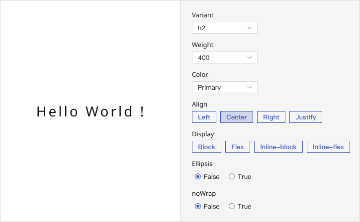
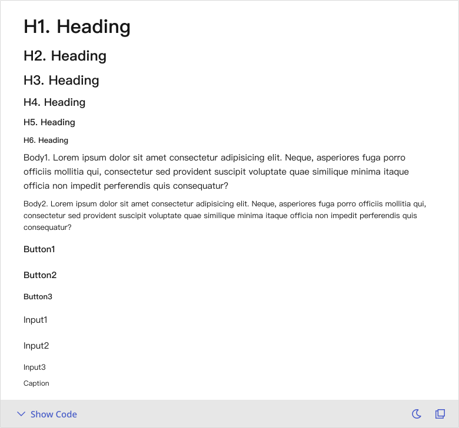
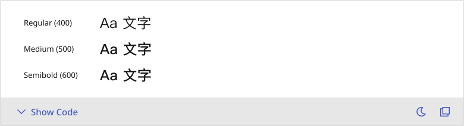

# Typography
Typography enables users to read and understand content through consistent and structured text presentation.

## Playground

## Usage Guide
Typography serves not only as a vessel for information but also as a foundational element for establishing visual hierarchy and stylistic coherence. It is applicable in a wide range of scenarios including headings, paragraph texts, button labels, input hints, and helper messages. Through the use of various typographic styles (e.g., h1–h6, body1, caption) and properties (e.g., font weight, alignment, line wrapping), it supports clear and accessible layout design.

    ### Best Practices
    - **Match semantic intent with style (variant):** Use h1–h6 for hierarchical headings, body1 and body2 for body text, and caption, input1, etc., for supplementary information.
	- **Maintain visual and structural consistency:** Preserve consistent size, weight, and line height for identical semantic elements across the system to avoid visual clutter.
	- **Use color to reflect intent or hierarchy:** For example, text-primary for primary content, text-disabled for non-interactive text.
	- **Utilize** `ellipsis` **or** `noWrap` **to manage space:** In constrained layouts, apply text truncation or no-wrap settings to maintain layout integrity.
	- **Adjust weight to emphasize meaning:** Modify font weight (e.g., bold, light) via the weight prop to support emphasis—while avoiding excessive visual noise.
    

    ### When Not to Use
    - **When content is better conveyed through imagery or numbers:** For highly visual or data-driven content, prefer components such as Icon or Chart over pure text.
	- **When layout is already defined by another component:** Avoid using Typography solely to apply style within components like tables—styling should be governed by the parent component.
	- **When semantic meaning and visual style are misaligned:** For instance, using body2 for a heading can confuse hierarchy, while styling insignificant content with h1 may impair clarity and maintainability.
    

    ### Usage Patterns
    - Typography is primarily used for **static content display**, but when applied within buttons, form hints, or status messages, its color or style may adapt according to external states such as disabled or error.
	- Typography styles remain consistent across all device sizes and are marked as “All” in the design specifications, indicating no need for breakpoint-specific adjustments in font size or line height.
	- In multilingual contexts—such as pages mixing Chinese and English—Typography adapts its font based on language; for example, English text within Chinese content switches to **PingFang TC**, while spacing and line height remain aligned with the original Chinese styling.
	- Typography may be embedded within other components (e.g., Button, Input), in which case the container component should determine the appropriate text style—such as button1 being the default for button labels—to ensure overall design consistency.
	- The `noWrap` prop can be used to constrain text to a single line, preventing line breaks—ideal for buttons, table headers, or card titles where layout cleanliness is essential.
	- When text exceeds the width of its container, `ellipsis` can be used to truncate the overflow and display an ellipsis (…). Ensure the container is set to `block` or `inline-block` for this feature to function correctly.
	- In cases where text truncation is likely, consider pairing with a **Tooltip or similar component** to reveal the full content, thereby enhancing readability and accessibility.

	

## Modes
    The Typography component is designed for presenting static content with clear structure and visual hierarchy. It is flexible enough to handle embedded usage, content truncation, and multilingual adaptation.

    ### Display Behavior
	- Non-interactive by default: Typography is intended for displaying static text and does not include built-in interactivity.
	- State-aware styling: When used within interactive elements (e.g., buttons, alerts), it can respond to component states (e.g., disabled, error) by adjusting color or style.
	- Customizable alignment and layout: Use align and display props to control alignment (left, center, right) and layout types (block, inline-block, etc.
    ### Responsive Rules
	- Unified across breakpoints: All variants are marked as “All”, meaning typography styles are consistent across desktops, tablets, and mobile devices.
	- Future flexibility: Responsive scaling can be added as needed, though it is not currently defined in the design system.

    ### Multilingual Support
    Typography dynamically adjusts font styles based on language:
	- Mixed-language content: In Chinese-English mixed paragraphs, only the English text switches to an appropriate Western typeface (e.g., PingFang TC + Helvetica), while spacing and line height remain as defined for Chinese.
	- All-English paragraphs: When a block of text is fully in English, it adopts a dedicated English style, including adjustments to line height and letter spacing for improved readability.

    ### Embedded in Other Components
    Typography can be embedded within other UI elements (e.g., Button, Input):
	- Style determined by container: For example, button1 is the default for buttons, while input2 is used for placeholder or helper text in forms—ensuring visual consistency.
	- Avoid overriding parent styles: If the parent component already defines a style, refrain from manually setting variant to prevent style conflicts.

    ### Text Truncation & Overflow Handling
    Typography provides noWrap and ellipsis props for controlling layout in limited space:
	- noWrap: Constrains text to a single line, preventing automatic line breaks. Commonly used in cards, headers, or UI elements where layout precision is crucial.
	- ellipsis: Truncates overflowing text with an ellipsis (…). This requires the container to be set to block or inline-block to function correctly.
	- Use with Tooltip: If text truncation is possible, pair with a Tooltip or similar mechanism to reveal the full content, improving both usability and accessibility.
    

    <!--### Display Behavior
        Typography content can be visually adapted depending on layout needs:
	    - **Single-line display:** Use noWrap to constrain text to a single line, preventing line breaks. Common in buttons, cards, or table headings.
	    - **Truncated text with ellipsis:** Combine noWrap with ellipsis to visually truncate overflowing content with “…” at the end. Ensure the element is rendered as block or inline-block for this to take effect.
	    - **Tooltip for full content:** For text that is truncated, consider pairing with a Tooltip or similar component to preserve accessibility and allow users to view the full content.

    ### Language-Aware Typography
        In multilingual environments, typography may require adjustments in font family or rendering style. For example:
	    - **Mixed Chinese-English content:** Only the font changes to accommodate English characters (e.g., switching to “PingFang TC”), while spacing and sizing remain based on Chinese layout standards.
	    - **All-English content:** The entire font stack and typographic rendering adapt to better match Latin script conventions (e.g., switching to “Noto Sans TC” or Helvetica).
        
    ### Component Integration
        Typography styles are often embedded within other components. In such cases, the container component defines the appropriate variant:
	    - **Buttons** use button1, button2 or button3.
	    - **Inputs** use input1, input2 or input3.
	    - **Tooltips** or captions use caption.-->

    
    

## Appearance
    Typography concerns the visual presentation of text—including typeface styles (variant), font weights (weight), colors (color), responsive sizing, and layout-related properties such as display and text-align. These settings ensure a cohesive visual language, clear semantic hierarchy, and adaptability across multilingual contexts and various usage scenarios.

    ### Anatomy
        The structure of Typography is defined by several key design aspects:
	    - Font and Weight: The primary typeface is “PingFang TC” (or alternatives based on language). A regular weight of 400 is recommended as the default, with variations used to convey emphasis and hierarchy.
	    - Font Size and Line Height: Each variant (e.g., h1, body1, caption) comes with defined font size and line height, shared across all devices for design consistency.
	    - Letter Spacing and Fine Details: Attributes such as letter spacing, inline spacing, and paragraph line height are fine-tuned per variant to ensure polished typography.

    ### Style Variants
        Typography offers a predefined set of style variants, each tailored for different semantic and functional roles in the interface:
	    - **Headings (h1 ~ h6):** Used to indicate content hierarchy and guide user focus. Larger sizes are reserved for page titles or section headers.
	    - **Body Text (body1, body2):** Applied to paragraphs and longer text blocks. body1 serves as the default and most common type for general content.
	    - **Button Text (button1 ~ button3):** Designed for embedded use within buttons. These variants maintain appropriate sizing, spacing, and weight for action-focused UI elements.
	    - **Input & Label Text (input1 ~ input3):** Used for form fields, placeholders, and associated labels to maintain clarity and readability in compact spaces.
	    - **Caption Text (caption):** Supports supplementary content such as annotations, tooltips, or metadata. Generally rendered in smaller font size and lighter weight.
        
        **📌 Note:**  Each variant includes a predefined font size, line height, letter spacing, and default font weight. These specifications are aligned with design system guidelines and do not change across responsive breakpoints.

        
    
    ### Weight Variations
        Although each style variant has a default weight, the weight prop allows developers to override it for emphasis or stylistic alignment:
	    - 400 – Regular (default for most variants)
	    - 500 – Medium
	    - 600 – Semibold

         

    ### Color Variants
    Icons support semantic color variants to visually represent different UI states or meanings. These are commonly used in conjunction with status messages, form feedback, or system alerts:
	    - success – Green (e.g., task completed)
	    - error – Red (e.g., validation failure)
	    - warning – Yellow (e.g., caution)
	    - info – Blue (e.g., neutral information)
	    - disabled – Grey (e.g., unavailable state)
	    - inherit – Inherits the text color from the parent element

    **📌 Note:**  Colors may be automatically adapted for light and dark modes according to design specifications, but this behavior may not yet be implemented in code.
    <!--Some semantic colors are not yet fully implemented in the system, with dark mode support to follow.-->
    

---

## Custom Disable
    <!-- 控制使用者在什麼條件下不能使用 -->
    The Typography component itself does not have a built-in disabled state or behavior, as it is designed primarily for presenting static text without interactive logic. However, when used in contexts like helper text, button labels, or form hints, it can visually represent a “disabled” or inactive state to indicate unavailable functionality.

    - **Representing Disabled State via Semantic Colors**
        - Although Typography lacks interactivity, you can apply semantic colors (e.g., color="disabled") to visually express a disabled state with gray tones.
        - Recommended use case: Use this in forms to indicate fields that are not yet available or to display text explaining actions the user cannot perform.
    - **Controlled by Parent Components When Embedded**
        - When Typography is used inside interactive components (e.g., Button, Input), the disabled state is typically managed by the parent. The embedded text will inherit visual cues like desaturation or dimming automatically.
        - Recommended use case: When used inside components like Button or Input, allow the parent component to control disabled styling to maintain visual consistency.
    - **Custom Styling for Standalone Disabled Text**
        - For standalone use cases where text needs to appear disabled, apply custom styling—such as gray text color or reduced opacity—to achieve the appropriate visual tone.
        - Recommended use case: In cards or paragraphs explaining upcoming or unavailable features.
    - **Combine with Tooltip for Contextual Feedback**
        - If text represents a disabled or unavailable action, consider pairing it with a Tooltip to explain the reason. This enhances clarity, readability, and accessibility.
        - Recommended use case: In form fields that are disabled due to unmet conditions, use a tooltip to explain why the field cannot be edited.

    

<h2 id="Val">Validation / Restrictions</h2>
    To ensure semantic clarity, consistent text styling, and accessibility across the interface, it’s important to define validation and restriction guidelines for how Typography is used.\
    These rules help prevent misuse, support a cohesive visual experience, and maintain alignment between design and engineering.

    The table below outlines common validation items for **Typography**, along with the primary responsibility of Designers and Developers:
    | Item | Description | 🎨 Designer | 🛠️ Developer |
    |-------|-------|-------|-------|
    | **Correct Semantic Style Mapping** | Heading and body text should match the intended content hierarchy using the appropriate variant (e.g., h1~h6, body1/2). Misuse can confuse users or distort visual structure. | Define which variant to use for each type of content (e.g., h1 for page title, body1 for paragraph text). | Apply the correct variant prop and avoid misusing heading styles for body content. |
    | **Consistent Font Weight and Styling** | Avoid arbitrary changes to font weight or overlapping visual cues (e.g., bold plus custom colors) to maintain readability and brand consistency. | Specify acceptable font weight ranges per style (e.g., use 700 only for emphasis). | Use the weight prop carefully and only apply allowed values (e.g., 400 as default). |
    | **Avoid Arbitrary Color Use** | Text colors should follow predefined semantic states (e.g., error, disabled) and not use unsupported or hard-coded colors. | Define text color usage rules per status (e.g., error messages in red). | Use the color prop with defined palette values and avoid manual hex codes. |
    | **Multilingual Typography Rules** | When displaying multilingual content, follow typeface and spacing rules: e.g., use PingFang TC for mixed Chinese-English, and a separate English style for full-English blocks. | Define font-family usage per language scenario and clarify spacing behavior. | Apply correct font family and variant per locale condition to maintain legibility. |
    | **Use of Truncation and Line Breaking** | Use ellipsis or noWrap only when necessary (e.g., space-constrained components like cards or tables) and always provide Tooltip or fallback access to full content. | Define when text truncation is allowed and when full wrapping is required. | Configure noWrap or ellipsis properly, and pair with Tooltip to preserve information accessibility. |
    | **Embedded Typography Must Follow Container Rules** | When Typography is embedded in other components (e.g., Button, Input), it should inherit the style from the container rather than override it. | Map which text style each component uses by default (e.g., Button uses button1). | Let the container define the variant; do not override Typography props unnecessarily. |

    
## Integration
     <!-- 元件「如何與其他應用層、框架、資料結構或函式庫協同工作」的方式 = 怎麼接進系統 -->
    ### Asset / Style Source
        - All text styles follow design system specifications, including:
	    - Font stack: "PingFang TC", "Noto Sans TC", Helvetica, Arial, sans-serif
	    - Variants: h1–h6, body1–body2, button1–button3, input1–input3, caption
	    - Each variant comes pre-configured with font size, line-height, letter spacing, and weight—no manual adjustment required.

    ### Component Integration Contexts
        Typography is frequently integrated with the following components. Choose appropriate variants based on the parent’s layout and purpose:
        | Component | Default Variant |
        |-------|-------|
        | **Button** | `button1` for primary actions |
        | **Input / Textarea** | `input1`~`input3` for labels, hints, and error messages |
        | **Toast / Alert** | `h5` for titles, `body2` for descriptions |
        | **Table / Card / List** | Use `body1`, `body2`, or `caption` based on information hierarchy |
        | **Empty State / Result** | Typically combines `h5` + `body2` to convey key and secondary messages |

        #### 📌 Additional Notes
	    - Label-based components such as Tag, Label, or Chip generally use caption or button2, with layout handled internally—no need to compose Typography manually.
	    - For multilingual UIs, font and spacing are automatically adjusted based on the language context (e.g., English-only vs. mixed Chinese-English). No manual overrides required.

        #### 🔧 Integration Tips
	    - Avoid setting padding or font-style externally around Typography to preserve design consistency.
	    - For interactive features like expandable text or tooltips, wrap Typography with additional containers—Typography itself remains display-only. 

     <!-- To ensure consistent and scalable usage across the product, Typography is designed to integrate seamlessly within the design system. While it functions as a standalone component for rendering text, it is also frequently embedded within other UI components to maintain clarity, hierarchy, and visual consistency across the interface.
    ### Font Source & Design Basis
        All Typography variants follow standardized design specifications, covering various levels of headers (h1–h6), body content (body1, body2), interactive text styles (button1–button3, input1–input3), and auxiliary text (caption). These ensure consistent visual hierarchy and typographic logic across different use cases.
	    - The unified font stack is: "PingFang TC", "Noto Sans TC", Helvetica, Arial, sans-serif.
	    - Each variant’s font size, line-height, letter spacing, and other properties are defined by design and built into the system—no manual adjustments are required.
	    - Based on the language context (e.g., full English paragraphs or mixed Chinese-English content), Typography will automatically apply the appropriate font style to ensure readability and semantic consistency.

    ### Component-Level Integration
        Typography is frequently used within other components to render headings, labels, or descriptions. In such cases, its styles should be determined by the parent component to avoid redundancy or styling conflicts:
	    - Button: Uses button1 as the default text style, with size and weight defined by design guidelines.
	    - Input / Textarea: Placeholder text, labels, and error messages follow the input1–input3 variants.
	    - Toast / Alert / Notification: Apply semantic styles according to context—for example, using h5 for titles and body2 for descriptions.
	    - Tag / Chip / Label: Use caption or button2 for compact yet readable category text.
	    - Table / List / Card: Select from body1, body2, or caption depending on the content level and information density.
	    - Empty States / Informative Messages: Use h5 and body2 together to convey primary and secondary messages.
	    - Multilingual Interfaces: For fully English paragraphs, the system automatically applies a dedicated English font style. In mixed-language cases, only the English portion switches fonts without affecting spacing or line height.

        **📌 Note:**  Typography is a purely presentational component and should not handle interaction logic. If you require interactive behaviors such as tooltips or text truncation with hover feedback, these should be managed by a wrapper or container component.-->

## Props Overview
     <!-- Appearance 控制外型、Behavior 控制互動行為、Data 資料處理、Validation 驗證相關、Events 事件回呼、Integration 整合支援 --> 
    ### Appearance
        Manages the visual presentation and layout of the component, including size, style variants, icon placement, spacing, and visibility states. These settings ensure consistency with the design system and help maintain visual hierarchy across the interface.

        | Property | Description | Type | Default |
        |-------|-------|-------|-------|
        | **color** | The color name provided by palette. | `disabled` `error` `inherit` `success` `warning` `primary` `secondary`    ... 26 more   | - |
        | **align** | The css variable for `text-align`. | `center` `left` `right` `justify` | - |
        | **display** | The css variable for `display`. | `block` `flex` `inline-block` `inline-flex` | - |
        | **variant** | Applies the typography variant. | `h1` `h2` `h3` `h4` `h5` `h6` `body1`   ... 8 more   | `"'body1'"` |
        | **weight** | The css variable for customizing `font-weight`. | `100` `200` `300` `400` `500` `600` `700` `800` `900`   ... 8 more   | - |
        | **display** | Override the component used to render. | `bTypographyComponent` | - |
        
    ### Behavior
        Controls the interactive behavior of the component, such as handling user actions, managing component states (e.g., loading, toggling), and enabling mode switching to support different usage scenarios.
        
        | Property | Description | Type | Default |
        |-------|-------|-------|-------|
        | ellipsis | If `true`, the text will not wrap, but instead will truncate with a text overflow ellipsis. Note that text overflow can only happen with `block` or `inline-block` level elements | `boolean` | `false` |
        | noWrap | If `true`, the text will not wrap. | `boolean` | `false` |
        
    ### Data
        Typography is a static display component and does not handle dynamic data input or value-related props. This category is not applicable.

    ### Validation
         Typography has no built-in validation logic, but design and development teams should follow the validation rules outlined in the <a href="#Val">**Validation / Restrictions**</a> section to ensure correct usage (e.g., matching variant semantics, avoiding unsupported styles).

    ### Events
        This component does not emit or handle events by itself. Any interactivity (e.g., click or hover behavior) should be controlled by the parent container component such as **Tooltip**, **Button**, or other wrappers.

    ### Integration
        Typography is commonly embedded in other components to render styled text. For example, buttons use button1, and input fields use input1~3. Variants should be managed by the container to avoid conflicting definitions and ensure consistent application. See the <a href="#integration">**Integration**</a> section for more.
        