# Drawer
Drawers slide in from the edge of the screen to present additional content or secondary actions, commonly used for advanced settings, filters, or detail panels.


## Playground


## Usage Guide
The Drawer provides a non-blocking way to present additional content or actions without disrupting the main workflow. It is designed for efficiency and focus, commonly used for viewing detailed information, setting advanced filters, or embedding complex modules that require additional space.

### Best Practices
- **Use for supplemental content**
    - Ideal for displaying modules that require extra space, such as forms, filters, or lists.
    - Consider using a backdrop to retain context while focusing attention.
- **Keep content focused**
    - Limit content to a single task or purpose to avoid cognitive overload.
    - Use clear titles or tabs to describe the drawer’s function.
- **Support clear dismissal**
    - Enable backdrop and ESC key to provide intuitive close behavior.
    - Ensure the user can always dismiss the drawer with clear feedback.


### When Not to Use
- **For primary workflows**: Avoid placing primary flows (e.g., full sign-up processes) inside a Drawer.
- **When nesting other overlays**: Refrain from nesting a Drawer inside another Drawer or Modal to avoid stack complexity and focus issues.
- **For full-screen content**: If content is too large for side presentation, consider using a full-page view or modal dialog instead.


### Usage Patterns
- **Control visibility via state**: The drawer's visibility should be controlled externally via the `open` prop and updated using the `onClose` callback.
- **Backdrop click or ESC key to close**: By default, the Drawer supports closing via backdrop click or ESC key, which can be disabled as needed.
- **Align animation with placement**: Ensure `placement` and `direction` are consistent—for example, a right-side drawer should slide in from the right.
- **Embed flexible content**: The Drawer can contain forms, filters, or even step flows. Structure the layout based on task complexity.
	


## Modes
### Left
- Slides in from the left side of the screen, typically used for primary or structural navigation.
- **Recommended For:** Sidebar menus, global navigation, or layout-level actions.

📌 This is one of the most commonly used drawer modes in both desktop and responsive designs.




### Right
- Slides in from the right, ideal for displaying details, settings, or side panels without disrupting the main flow.
- **Recommended For:** Detail views, contextual menus, or advanced settings.




### Bottom
- Expands from the bottom of the screen, often used in mobile or constrained viewports.
- **Recommended For:** Form inputs, quick actions, or compact menus on mobile devices.




### Top
- Reveals from the top of the screen, typically used for lightweight notifications or global filters.
- **Recommended For:** System alerts, filtering controls, or global action menus.



---

### Persistent *(Not Yet Supported)*
- A permanently visible drawer that anchors content on the left or right side.
- **Recommended For:** Desktop dashboards, multi-panel layouts, or always-on navigation panels.

📌 This mode is currently not supported. Use `placement` and layout containers when customizing manually.


### Full-Screen *(Not Yet Supported)*
- Occupies the entire screen, often used for immersive workflows or mobile-first flows.
- **Recommended For:** Onboarding, multi-step forms, or modal-level tasks.

📌 This mode is not yet available but may be introduced in future design/engineering iterations.


    
    


## Appearance
### Anatomy
1. **Trigger Element**: Any UI element (button, icon, etc.) that initiates the drawer. Not part of the drawer itself.
2. **Drawer Panel**: The main content container that slides in from the specified edge (left, right, top, or bottom).
3. **Backdrop (Optional)**: A semi-transparent overlay behind the drawer to prevent interaction with background content.
4. **Close Mechanism**: Typically includes escape key support, backdrop click, or an internal close button.
5. **Portal Container**: The optional DOM container the drawer is rendered into (via portal), allowing flexible placement.


### States
- **Open**: The drawer panel is fully visible and interactive.
- **Closed**: The drawer is hidden and removed from the flow.
- **With Backdrop**: A semi-transparent overlay appears behind the drawer when open.
- **Without Backdrop**: Drawer opens directly without background overlay (e.g., for minimal layouts).
- **Disabled Closing**: Configurable to disable closing by escape key or backdrop click.


### Backdrop
- **Default**: Includes a semi-opaque black backdrop that fades in with the drawer.
- **Invisible**: When enabled, the backdrop retains its interaction layer but is visually hidden.
- **Hidden**: No backdrop is rendered at all, allowing full interaction with the underlying interface.

📌 For custom styling, refer to the `breaktop` component page for backdrop style specifications.


### Transition Animation
- **Slide In**: The drawer panel slides in from the specified edge (left, right, top, or bottom).
- **Fade In (Backdrop)**: The backdrop fades in concurrently with the sliding panel for visual smoothness.


### Interaction Layer
- Drawer supports multiple ways to dismiss the panel:
  - **Click on Backdrop**
  - **Press Escape Key**
  - **Click Internal Close Button**
- Each interaction can be individually enabled or disabled for precise control.

📌 Use props like `disableCloseOnBackdropClick` or `disableCloseOnEscapeKeyDown` to manage these behaviors.


---


## Custom Disable
<!-- 控制使用者在什麼條件下不能使用 -->
Drawer does not include built-in restrictions for disabling open/close actions, but developers can implement custom logic based on specific business conditions. Below are typical usage patterns:

### Conditional Open
- Prevents the drawer from being triggered unless certain conditions are met (e.g., terms agreed, form validated).
- Useful in flows where prerequisites must be fulfilled before user interaction is allowed.
```
<Button onClick={() => {
  if (isReady) setOpen(true);
  else alert("Please complete the required steps.");
}} />
```

### Exit Guard with Confirmation
- Adds a validation layer before closing the drawer.
- Common for unsaved forms or incomplete actions; typically prompts the user before exiting.
```
onClose={() => {
  if (hasUnsavedChanges) {
    showConfirmModal("You have unsaved changes. Exit anyway?", () => setOpen(false));
  } else {
    setOpen(false);
  }
}}
```

### Disable Internal Interactions
- Disables parts of the drawer UI based on logic like user roles, step completion, or data validation.
- Often used for form fields, action buttons, or section overlays.
```
<Drawer open={open}>
  <TextField disabled={!hasPermission} />
</Drawer>
```
---

**📌 Note:** Drawer does not natively handle disable logic such as validation-on-close or stateful lockouts. These behaviors must be implemented externally via `open`, `onClose`, or wrapper logic.


## Validation / Restrictions
To ensure consistent behavior and user experience of the Drawer component, proper validation and restriction logic should be applied.\
Since drawers are often used for forms, settings, or step-based workflows, it’s crucial to manage input completeness, exit behavior, and conditional visibility with care.\

The table below outlines key validation items for **Drawer**, along with responsibilities for designers and developers:
| Item | Description | 🎨 Designer | 🛠️ Developer |
|-------|-------|-------|-------|
| **Conditional Open** | Drawer should only open when specific requirements are fulfilled. | Provide clear triggers and visual cues (e.g., tooltips, helper text). | Control the open state based on logic and prevent invalid triggers. |
| **Exit Guard Validation** | Before closing, Drawer should check for unsaved changes or incomplete actions. | Design clear confirmation dialogs or warnings. | Implement onClose checks and confirmation prompts. |
| **Input Field Validation** | Form fields within the drawer require validation for correctness and completeness. | Define error messaging style and validation timing (e.g., on change or submit). | Add validation logic and display error states accordingly. |
| **Restricted Interaction** | Certain drawer areas or fields may be disabled based on user roles or process states. | Visually differentiate disabled elements and explain why they’re inactive. | Apply disabled or readOnly props and adjust visibility if needed. |
| **Empty State Handling** | When no data or settings are available, fallback content should be shown. | Use friendly visuals and guidance (e.g., illustration with message). | Render empty states based on content availability. |

    
## Integration
 <!-- 元件「如何與其他應用層、框架、資料結構或函式庫協同工作」的方式 = 怎麼接進系統 -->
### Asset / Style Source
- The visual appearance of the Drawer follows the Mezzanine Design System, including elevation, border radius, spacing, typography, and motion.
- Slide transition effects are used for entering and exiting; avoid overriding these transitions with custom CSS.
- Do not override internal layout styles, as this may disrupt positioning, backdrop behavior, or closing logic.


### Component Integration Contexts
Drawers are commonly used as semi-modal interactive containers in the following scenarios:
| Use Case | Integration Purpose |
|-------|-------|
| **Form Workflow** | Hosts forms for input or submission without navigating away from the current page. |
| **Detail Panel** | Reveals contextual information (e.g., logs, user profile) without leaving the main interface. |
| **Settings Panel** | Provides control interfaces for preferences, roles, or permissions. |

> ☑️ **Integration Tips**:  
> - Avoid rendering multiple drawers simultaneously in dynamic contexts (e.g., data tables).  
> - Use global state or route-based logic to synchronize open/close behavior with app state.


### Behavior Delegation
Drawer does not manage internal state. Open/close control and behavioral logic should be handled externally:
| Interaction Type | Responsibility |
|-------|-------|
| **Open/Close Control** | Managed via external state and `onClose` callbacks. |
| **Inner Interaction Logic** | Form submission, validation, and internal controls are owned by the parent. |
| **Pre-Close Handling** | Any exit conditions or confirmations should be implemented in `onClose` logic. |

> Can be integrated with state management solutions like React Context, Zustand, or Redux.


### Rendering / Performance Considerations
- Drawer content is only rendered when the drawer is open, reducing initial DOM load.
- For complex layouts, consider lazy-loading inner sections or deferring heavy computations.
- Avoid immediately unmounting during close transitions to ensure smooth visual feedback.


### Library / Data Dependency
- Drawer does not rely on any external data schema or third-party library.
- If asynchronous data is required, initiate loading when the drawer opens and display appropriate loading indicators.
- Supports flexible content composition, including forms, lists, charts, and other custom components.


## Props Overview
<!-- Appearance 控制外型、Behavior 控制互動行為、Data 資料處理、Validation 驗證相關、Events 事件回呼、Integration 整合支援 --> 
### Appearance
Manages the visual presentation and layout of the component, including size, style variants, icon placement, spacing, and visibility states. These settings ensure consistency with the design system and help maintain visual hierarchy across the interface.

| Property | Description | Type | Default |
|-------|-------|-------|-------|
| **placement** | Whether the drawer placement. | <font color="#BD3B3B">`"left"` `"right"` `"top"` `"bottom"`</font> | `"'left'"` |
| **direction** | Control slide fade in direction. | <font color="#BD3B3B">`"left"` `"right"` `"up"` `"down"`</font> | `"'down'"` |
| **hideBackdrop** | Whether to hide backdrop. | <font color="#BD3B3B">`boolean`</font> | `false` |
| **invisibleBackdrop** | Whether to set backdrop invisible. | <font color="#BD3B3B">`boolean`</font> | `false` |
        

### Behavior
Controls the interactive behavior of the component, such as handling user actions, managing component states (e.g., loading, toggling), and enabling mode switching to support different usage scenarios.
        
| Property | Description | Type | Default |
|-------|-------|-------|-------|
| **open** | Controls whether to show the element. | <font color="#BD3B3B">`boolean`</font> | `false` |
| **container** | The destination where to portal. | <font color="#BD3B3B">`ElementGetter`</font> | - |
| **disablePortal** | Whether to disable portal. If true, it will be a normal component. | <font color="#BD3B3B">`boolean`</font> | `false` |
| **disableCloseOnBackdropClick** | Controls whether to disable closing element while backdrop clicked. | <font color="#BD3B3B">`boolean`</font> | `false` |
| **disableCloseOnEscapeKeyDown** | Controls whether to disable closing modal while escape key down. | <font color="#BD3B3B">`boolean`</font> | `false` |

        
### Data
*The Drawer does not manage or manipulate internal data. It serves as a container for dynamic content such as forms, filters, or detail views. All data rendering and updates should be handled externally.*


### Validation
*Drawer does not include any validation logic. If it contains forms or interactive fields, validation should be handled by the respective inner components or parent container.*


### Events
Specifies event callbacks triggered by user interactions (e.g., onChange), allowing the component to communicate with external systems or trigger further processing logic.

| Property | Description | Type | Default |
|-------|-------|-------|-------|
| **onClose** | Callback fired while the element will be closed. | <font color="#BD3B3B">`VoidFunction`</font> | - |
| **onBackdropClick** | Click handler for backdrop. | <font color="#BD3B3B">`MouseEventHandler`</font> | - |


### Integration
*Drawers are commonly used for secondary panels like advanced filters, user details, or configuration steps. Visibility is controlled externally via the `open` prop, and interactions like closing should be explicitly handled using `onClose`. For best user experience, integrate with backdrop behaviors, escape handling, and directional animation logic. If forms are embedded, ensure proper submission, validation, and focus management.*