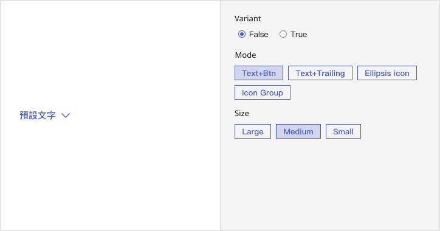
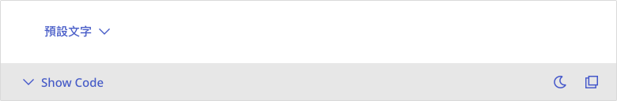
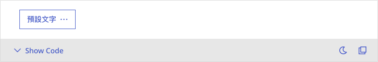
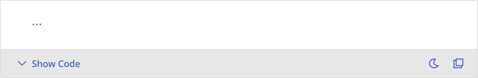
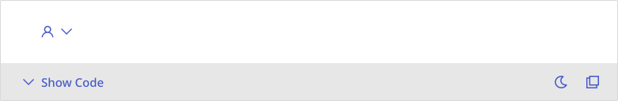

# Dropdown
Dropdowns allow users to reveal a list of selectable options by clicking a trigger element, typically used for simple single-choice selections.

## Playground

## Usage Guide
Dropdown enables users to make a single selection from a predefined list, commonly used in scenarios such as filtering content, selecting configurations, or performing lightweight actions within a compact UI. It provides a clean and efficient way to present limited options without overwhelming the interface. By deferring less critical choices into an expandable menu, Dropdowns help reduce visual clutter and streamline decision-making, especially in responsive or space-constrained layouts.

### Best Practices
- **Use for single-selection cases:** Dropdown is ideal when users need to choose only one option from a list.
- **Keep interactions simple and lightweight:** When no complex logic is required, Dropdown provides a clean and efficient solution.
- **Choose the visual variant based on UI needs:** Icon-only or text + icon variants can improve clarity and maintain visual consistency.
- **Adapt size to context:** Use smaller sizes for mobile views or constrained spaces to ensure usability and legibility.

### When Not to Use
- **When multi-selection is needed:** Dropdown does not support multiple selections; use a multi-select component or checkbox group instead.
- **When keyboard accessibility is required:** Avoid using Dropdown in interfaces that require full keyboard navigation or accessibility compliance.
- **When option lists are too long or need filtering:** For over 7–8 items or searchable scenarios, consider a more advanced selector with search capabilities.

### Usage Patterns
- **Toggle visibility with click:** Clicking the trigger toggles the dropdown. Clicking outside or selecting an item will close it.
- **Grow animation on open:** Uses a smooth Grow animation to enhance transition feedback.
- **Supports disabled state:** Can be configured as non-interactive for disabled or unavailable scenarios.
- **Scrollable content area:** Enables vertical scrolling automatically when the list exceeds visible space.
- **Optional click-away close behavior:** By default, clicking outside the dropdown closes it. This can be disabled via the `disabledClickAway` prop.
	

## Modes
### Basic
- Suitable for standard single-selection actions such as filters, setting panels, or contextual menus.
- Recommended For: Form inputs, toolbar commands, or simple task-based interactions.

📌 This is the most common dropdown style and serves as the foundation for extended formats.

### Text + Trailing Icon
- Combines label and trailing icon (typically a chevron) to indicate dropdown affordance.
- Recommended For: Sort menus, toggle controls, or interface areas where clarity is critical.

    
### Ellipsis Icon
- Uses an ellipsis (or similar) icon as a trigger, ideal for minimal or space-constrained layouts.
- Recommended For: Card actions, row-level menus in tables, or mobile-first designs.

### Icon Group
- Embeds icon-only dropdowns into a set of related icons for visual consistency.
- Recommended For: Toolbars, editors, or densely packed UI areas with grouped controls.

## Appearance
### Anatomy
1. **Trigger Button**: The clickable element that opens the dropdown menu; supports various styles such as icon-only or text + icon.
2. **Dropdown Menu**: A floating container holding a list of selectable options; supports scrolling when overflow occurs.
3. **Menu Item**: Interactive entries within the dropdown; can be text-only or contain icons.
4. **Popper Container**: A positioning wrapper that aligns the menu relative to the trigger.
5. **Arrow Indicator (Optional)**: A small arrow pointing to the trigger, used for visual connection when necessary.

### States
- **Default**: Normal, interactive state.
- **Hover**: Indicates interactivity with background or border highlight.
- **Pressed / Activated**: Highlights the trigger when the menu is open.
- **Disabled**: Prevents interaction with the trigger or menu items, typically shown in grayscale or reduced opacity.    

### Sizes
Dropdown supports multiple predefined sizes:
- **Small**: Best for compact UI regions like toolbars or tight forms.
- **Medium**: The default size for general-purpose use.
- **Large**: Useful for prominent UI sections or high-visibility controls.

### Animation
- Dropdown menu uses a **Grow animation** that scales outward from the center.
- The animation enhances fluidity without interrupting the user’s flow.

### Spacing
- A consistent gap is maintained between the trigger and menu to ensure clarity and visual hierarchy.
- Menu items include internal padding for readability and tap area comfort.
- Dropdown menu features padding and border radius to match design system aesthetics.

---

## Custom Disable
<!-- 控制使用者在什麼條件下不能使用 -->
In specific scenarios, it may be necessary to dynamically disable the entire dropdown or its individual options based on contextual logic, such as:

- When the parent form is in read-only mode.
- When a prerequisite field is not completed or validated.
- When the dropdown options are empty or still loading.

While the dropdown does not provide built-in conditional logic, developers can use the `disabled` prop (or equivalent menu item config) to control both component-wide and item-level availability. It’s recommended to implement such logic externally, following state-driven UI patterns.    

## Validation / Restrictions
To ensure consistent behavior and usability of the Dropdown component, proper validation and restriction logic should be applied.\
As this component is often used in filtering menus or contextual actions, it’s critical to avoid exposing irrelevant or invalid options, and to manage its interactive state under different conditions.\

The table below outlines key validation items for **Dropdown**, along with responsibilities for designers and developers:
| Item | Description | 🎨 Designer | 🛠️ Developer |
|-------|-------|-------|-------|
| **Disabled Options** | Certain options may be unavailable due to permissions or status. | Clearly indicate disabled options (e.g., dimmed style) and offer tooltip explanations. | Add `disabled` flags to data and prevent selection logic. |
| **Disabled Dropdown** | The entire component may be inactive under certain conditions. | Clearly show non-clickable state and explain why. | Use the `disabled` prop or control logic to block interactions. |
| **Filtered Options** | Menu items may vary depending on role, context, or data. | Define filtering rules and ensure a clear layout for conditional content. | Filter `menu` items dynamically based on props or external data. |
| **Guard Logic** | Prevent redundant selections or restrict further actions after selection. | Provide clear visual cues and interaction patterns. | Detect redundant choices and apply limitations where necessary. |
| **Empty State Handling** | There may be no available options to display. | Provide a friendly message like “No options available.” | Handle empty menu lists gracefully with fallback UI. |

    
## Integration
 <!-- 元件「如何與其他應用層、框架、資料結構或函式庫協同工作」的方式 = 怎麼接進系統 -->
### 🎨 Asset / Style Source
- The visual appearance of the Dropdown follows the Mezzanine Design System, including spacing, typography, borders, shadows, and transition effects (e.g., Grow).
- When using icon-only or icon-text triggers, only use icons from the Mezzanine Icon Library. Third-party icons should not be used unless approved by the design team.
- Avoid style overrides that may disrupt hover, pressed, or active states. Ensure alignment, padding, and caret behavior match design specifications.

### 🔗 Component Integration Contexts
Dropdowns are commonly used in action menus, compact selectors, or filter conditions. Typical integration scenarios include:

| Use Case | Integration Purpose |
|-------|-------|
| **Action Menu** | Provides a contextual entry point for actions, e.g., item-level "more" (ellipsis) menus. |
| **Field Selector** | Used for switching between data fields or dimensions (e.g., report breakdown). |
| **Compact Picker** | Replaces bulkier Select components when fewer items are present. |
| **Filter Control** | Works as part of filtering systems for lists or tables. |

> ☑️ **Integration Tips**:
> - Use scrollable menus with height limits for long option lists.
> - Prevent dropdown menus from being clipped by overflow containers or stacking contexts.

### ⚙️ Behavior Delegation
The Dropdown does not internally manage state or selection logic. Control should be delegated to the parent context:

| Interaction Type | Responsibility |
|-------|-------|
| **Menu Toggle Logic** | The parent should handle open/close via `onOpen`, `onClose`, or external state. |
| **Item Click Handling** | Menu item actions should be defined by the consumer component. |
| **Conditional Visibility** | Render menu items based on external conditions or access logic. |
| **Placement & Positioning** | Use `popperProps` or custom logic to ensure proper menu positioning and avoid viewport issues. |

> Can be integrated with state management tools such as React Context, Zustand, or Redux.

### 🚀 Rendering / Performance Considerations
- Dropdown content is rendered only when open, minimizing unnecessary DOM usage.
- For large lists, use scrollable containers or integrate with virtualization libraries like `react-window`.
- Avoid blocking main thread during menu rendering; use lazy-loading or deferred data fetch where necessary.

### 📦 Library / Data Dependency
- Dropdown has no intrinsic dependency on specific data structures or external libraries.
- For server-integrated use cases, fetch menu content on demand when opening the dropdown.
- The `menu` prop accepts custom render content, including icons, group labels, descriptions, etc., without needing third-party libraries.

## Props Overview
 <!-- Appearance 控制外型、Behavior 控制互動行為、Data 資料處理、Validation 驗證相關、Events 事件回呼、Integration 整合支援 --> 
### Appearance
*The Dropdown component does not expose visual customization props such as `variant` or `size`. Its appearance—such as icon-only or text+icon—depends entirely on the trigger content provided. Styling should follow the design system’s specifications.*
        

### Behavior
Controls the interactive behavior of the component, such as handling user actions, managing component states (e.g., loading, toggling), and enabling mode switching to support different usage scenarios.  

| Property | Description | Type | Default |
|-------|-------|-------|-------|
| **disableClickAway** | Whether to disable triggering onClose while clicked away. | `boolean` | `false` |
| **popperProps** | the props of popper | `PopperProps` | - |

### Data
Handles the structure, input, and display of data within the component, including content rendering, default values, and formatting. Ensures the component properly reflects and updates data as expected.

| Property | Description | Type | Default |
|-------|-------|-------|-------|
| **menu** | the dropdown menu | `ReactNode` | - |

### Validation
*The Dropdown does not handle any built-in validation. If you need to control which items are selectable or visible, this logic should be implemented within the parent component or within the custom `menu` content.*

### Events
Specifies event callbacks triggered by user interactions (e.g., onChange), allowing the component to communicate with external systems or trigger further processing logic.

| Property | Description | Type | Default |
|-------|-------|-------|-------|
| **onClose** | The handler fired while clicked away. | `((event: ClickAwayEvent) => void)` | - |

### Integration
*Dropdowns are often used in conjunction with action menus, field selectors, or data filters. Positioning is handled by Popper.js, while menu content is fully controlled via the `menu` prop. When integrating with other components (such as buttons or icons), ensure the trigger element is well defined and consider accessibility attributes like `aria-haspopup`. The Dropdown itself does not manage state or data—it is the responsibility of the integrating component to do so.*