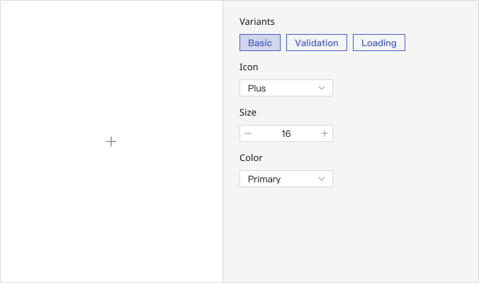

# Name

## Playground

## Usage Guide

    ### Best Practices
    -
    

    ### When Not to Use
    -
    

    ### Action Flow
    1. 
	

## Modes
    ### 
        - 

    ### 
        - 

    ### 
        - 

    ### 
        - 

    
    

## Appearance
    ### Anatomy
    

    ### Color Variants
    

    **📌 Note:**  

        

    ### States
        

    ### Sizes

---

## Custom Disable
    <!-- 控制使用者在什麼條件下不能使用 -->
    

## Validation / Restrictions
    To ensure accurate semantic expression, consistent interactions, and accessibility across the interface, it is important to define validation and restriction rules for how icons are used.\
    These checks help prevent incorrect usage, maintain a coherent user experience, and support both design and engineering alignment.\

    The table below outlines common validation items for **???**, along with their primary audience (Designer / Developer):
    | Item | Description | 🎨 Designer | 🛠️ Developer |
    |-------|-------|-------|-------|
    |  |  |  |  |
    |  |  |  |  |

    
## Integration
     <!-- 元件「如何與其他應用層、框架、資料結構或函式庫協同工作」的方式 = 怎麼接進系統 -->
    ### 

## Props Overview
     <!-- Appearance 控制外型、Behavior 控制互動行為、Data 資料處理、Validation 驗證相關、Events 事件回呼、Integration 整合支援 --> 
    ### Appearance
        Manages the visual presentation and layout of the button, including size, variant, icon placement, and color schemes. These settings ensure consistency with the design system and maintain visual hierarchy across the interface.

        | Property | Description | Type | Default |
        |-------|-------|-------|-------|
        | **color** |  | `` |  |
        | **size** |  | `` |  |
        

    ### Behavior
        Controls the interactive behavior of the button, such as handling loading states, disabling interactions, and toggling danger styles. These props define how the button responds under different user interactions and system states.
        
        | Property | Description | Type | Default |
        |-------|-------|-------|-------|
        |  |  | `` |  |

        
    ### Data
        Handles data structure and content within the button, including icon components or children elements. Ensures that the button displays the correct content, and aligns with functional roles such as form submission or navigation.

        | Property | Description | Type | Default |
        |-------|-------|-------|-------|
        |  |  | `` |  |

    ### Validation
         

    ### Events
    

    ### Integration
        