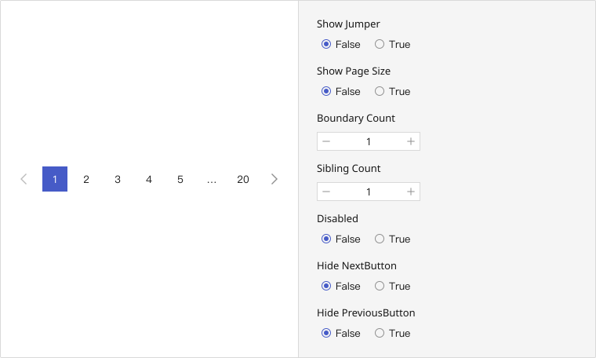
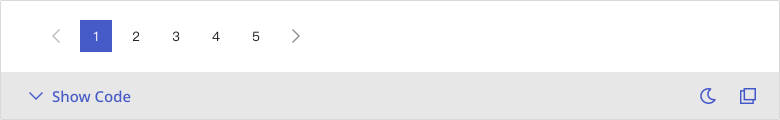
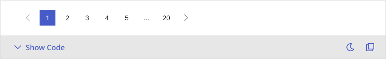
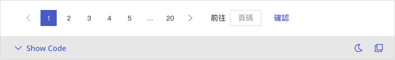
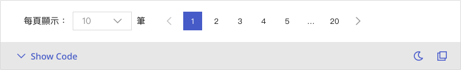
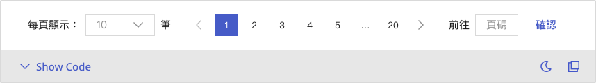

# Pagination
Pagination divides large datasets into manageable pages, enabling efficient navigation and improving performance while preserving a clean and organized interface.

## Playground

## Usage Guide
<!--Pagination can consist of various sub-components, such as “Previous/Next” buttons, page numbers, ellipsis indicators (…), a quick-jump input (Jumper), and a page size selector. These elements can be shown or hidden depending on the context. Typically paired with data tables, Pagination serves as a navigation tool for browsing segmented datasets.

    ### Best Practices
    - **Preserve essential pagination controls:** Always include “Previous” and “Next” buttons alongside a limited number of visible page numbers to reduce visual clutter. Parameters like boundaryCount and siblingCount can be used to fine-tune visibility.
	- **Enable direct page access (Jumper):** For large datasets, a Jumper input field allows users to enter a target page, minimizing repetitive clicks.
	- **Maintain consistent layout and ordering:** When using multiple controls (e.g., page size selector, page numbers, jumper), a recommended order is: *Page Size Selector > Page Numbers > Jumper*, ensuring visual harmony.
	- **Differentiate states clearly:** Each interactive state—disabled, selected, hovered, or pressed—should be visually distinct to avoid confusion and misclicks.
	- **Align with associated table elements:** When used with a Table component, follow its default spacing and alignment to maintain design consistency.

    ### When Not to Use
    - **When the dataset is minimal:** If all data can be displayed on a single page, omit Pagination to reduce unnecessary interaction.
	- **On extremely limited screen real estate:** On mobile or compact interfaces where layout constraints exist, consider alternative patterns like infinite scrolling or progressive loading.
	- **When total page count is unavailable:** If the backend cannot provide accurate pagination metadata or support page jumping, the use of Pagination may lead to a confusing experience.
    

    ### Action Flow
    1. Users navigate pages by clicking on page numbers or “Previous/Next” buttons. The component emits an `onChange` event with the new page number, which the parent component uses to update content.
	2. If the Jumper is enabled, users can enter a specific page number and trigger navigation via a confirmation button.
	3. When the Page Size Selector is visible, users can change the number of items per page. This triggers an `onChangePageSize` event and resets the current pagination state.
	4. Conditional behaviors like `hideNextButton` or `disabled` allow customization of navigation controls based on context or permissions.
	5. When integrated with a Table component, pagination state should be tightly coupled with the table’s data updates to ensure synchronization and coherence across the UI.-->

Pagination organizes large datasets into manageable chunks, allowing users to navigate across multiple pages of content with control and clarity. It supports browsing, filtering, or reviewing scenarios where users need sequential access to data. Clear indicators, interactive controls, and accessibility affordances make pagination crucial for content-rich applications.

### Best Practices
- **Preserve essential pagination controls:** Always include “Previous” and “Next” buttons with a minimal number of visible page numbers to avoid clutter. Use `boundaryCount` and `siblingCount` to fine-tune visibility.
- **Enable direct page access (Jumper):** For large datasets, allow users to enter a page number to jump directly to it.
- **Maintain consistent layout and ordering:** When combining controls like page size selector, page numbers, and jumper, a recommended order is: *Page Size Selector > Page Numbers > Jumper*.
- **Differentiate states clearly:** Ensure that disabled, selected, hovered, and active states are visually distinct to reduce errors and enhance usability.
- **Align with associated table elements:** Match spacing and alignment with the Table component if used together to maintain visual coherence.

### When Not to Use
- **When the dataset is minimal:** If all data fits on a single page, remove Pagination to avoid unnecessary interaction.
- **On limited screen space:** For compact interfaces like mobile devices, consider infinite scroll or progressive loading instead.
- **When total page count is unknown or unsupported:** If your backend doesn’t provide pagination metadata, avoid using this component to prevent user confusion.

### Usage Patterns
<!--1. Users navigate using page numbers or “Previous/Next” buttons. This triggers an `onChange` event with the new page number.
2. If the Jumper is enabled, users can type a page number and confirm to jump directly.
3. If the Page Size Selector is visible, users can select a new page size. This triggers an `onChangePageSize` event and resets the current page state.
4. Conditional behaviors (like `hideNextButton`, `disabled`) allow context-aware control of navigation elements.
5. When used with a Table, pagination state must synchronize with the table's data updates to ensure seamless user experience.-->
- **Page Switching Behavior**: Clicking a page number or navigation button triggers `onChange` with the new page number, letting the parent update content.
- **Jump to Page**: If the Jumper is enabled, users can input a page number and jump directly after confirmation.
- **Page Size Control**: If visible, the selector allows users to choose items per page. This triggers `onChangePageSize` and resets current page state.
- **Conditional Logic**: Props like `hideNextButton` and `disabled` allow contextual control of navigation availability.
- **Integration with Data Views**: When used with components like `Table`, pagination state should sync with content updates to ensure alignment.

## Modes
### Basic
- The most commonly used pagination layout, featuring only page numbers along with “Previous” and “Next” buttons.
- Recommended For: Simple pagination scenarios with a limited number of pages (e.g., 3–7 pages).

### With Ellipsis
- When total page count is high, this mode automatically replaces distant page numbers with ellipses (...), showing only the current page, adjacent pages, first, and last pages—enhancing clarity and reducing clutter.
- Recommended For: Large datasets with more than 10 pages.

### With Jumper
- Allows users to directly input a page number for quick navigation. Includes a label (e.g., “Go to”), an input field, and a confirmation button.
- Recommended For: Use cases that involve extensive pagination where users may need to jump to a specific page.

### With Page Size Selector
- Enables users to define how many items are displayed per page. Typically includes a label (e.g., “Items per page”), a dropdown menu, and a unit suffix (e.g., “items”).
- Recommended For: Scenarios requiring flexible data display options or user-adjustable pagination density.

### Combined
- Combines multiple modes—such as page numbers, jumper, and page size selector—into a single, comprehensive interface.
- Recommended For: Complex data-heavy environments where users benefit from full control over navigation and display preferences.

## Appearance
### Anatomy
1. **Previous / Next Buttons:** Located at both ends of the pagination control, these buttons allow users to navigate to the previous or next page.
2. **Page Number Buttons:** Display a selection of clickable page numbers. When there are many pages, the component supports truncation using ellipsis to minimize visual clutter.
3. **Ellipsis Indicators:** Represent skipped sections of pages when the total count is high. Ellipses maintain a streamlined interface while hinting at undisplayed page numbers.
4. **Jumper:** Includes a “Go to” label, an input field for entering a page number, and a confirmation button. It provides a fast-track mechanism for direct navigation.
5. **Page Size Selector:** Consists of a descriptive label (e.g., “Items per page”), a dropdown menu for selecting the number of items, and an optional unit label such as “items”.

### Variants
The Pagination component maintains a streamlined and utilitarian visual style. Rather than offering multiple visual themes (e.g., primary, secondary), its design emphasizes clarity and density of information. Visual variations are primarily determined by the inclusion or omission of sub-components like the Jumper or Page Size Selector.

### States
- **Inactive:** Default state for interactive elements that haven't been selected.
- **Hover:** Visual feedback when the user hovers over an interactive element.
- **Pressed:** Temporary visual state while an element is being clicked.
- **Enabled & Selected:** Indicates the currently active page. This state is visually emphasized.
- **Disabled:** Applied to elements that are not interactive (e.g., "Previous" button on the first page).
- **Disabled & Selected:** Rare state where the active page is simultaneously non-interactive, typically due to application-specific constraints.        

### Sizes
Pagination does not offer explicit size variants such as small, medium, or large. Instead, it aligns visually with surrounding components—such as Tables or Search Bars—by matching control and input field dimensions. This ensures a cohesive and balanced layout across the interface.

---

## Custom Disable
<!-- 控制使用者在什麼條件下不能使用 -->
Pagination does not offer additional options for disabling specific interactions.\
All interactions—such as page switching, jumping, and page size selection—are automatically managed based on the **current page** and **total page** count, with no need for manual customization.\
    
For advanced requirements (e.g., restricting access to certain pages based on user permissions), it is recommended to handle such logic at the application level to avoid introducing unintended behavior into the component.\

| Behavior | Handled Automatically | Notes |
|-------|-------|-------|
| **Auto-disable “Previous” and “Next” buttons** | ✅ Yes | Automatically determined based on the current page number and total page count. |
| **Display only available page numbers** | ✅ Yes | The pagination component dynamically calculates which page numbers to display (including ellipsis), based on the current page and total pages. |
| **Hide Jumper and Page Size Selector when total items are fewer than one page** | ⚠️ No | Engineering must conditionally hide these UI elements when not applicable. |
| **Prevent Jumper input from exceeding page range** | ⚠️ No | The Jumper is a plain input field. Validation logic should be handled separately to restrict input values. |
| **Restrict navigation to specific pages based on user permissions** | ❌ No | This requires business logic outside the scope of the component. Should be handled at the application or API level. |

    

## Validation / Restrictions
To ensure accurate and stable user interactions within the Pagination component, it is essential to define and implement a comprehensive set of validation and restriction rules.\
These measures prevent users from submitting invalid inputs, navigating to unavailable pages, or encountering unexpected behaviors, thereby maintaining logical consistency and reliability.\

The table below outlines common validation items for **Pagination**, along with the primary responsibility of Designers and Developers:\
| Item | Description | 🎨 Designer | 🛠️ Developer |
|-------|-------|-------|-------|
| **Required** | When used in a form or search flow, determine if the pagination input (e.g., Jumper) must be provided. | Indicate the required nature visually (e.g., asterisk or helper text), and provide visual feedback when invalid. | Implement validation logic to prevent empty or missing input and return clear error messages. |
| **Page Number Range** | Prevent users from jumping to a page less than 1 or beyond the total number of pages. | Prevent excessive input through UI constraints or provide real-time error feedback. | Validate Jumper input to restrict invalid entries and show relevant messages. |
| **Page Size Options** | Only display practical and reasonable options (e.g., 10, 20, 50 items per page). | Offer selection based on expected user needs and interface constraints. | Configure valid options via props or backend data; support customized labels and unit formats if needed. |
| **Conditional Behavior** | When data volume is minimal (e.g., only one page), certain controls like Jumper or Size Selector should be hidden or disabled. | Reflect the disabled or hidden states visually, especially in edge-case scenarios. | Dynamically determine available controls based on data and disable/hide where appropriate. |
| **Permission-based Restrictions** | Certain pages may be inaccessible based on user roles or data scope. | Ensure clear status indicators to avoid confusion or incorrect expectations. | Block access to restricted pages and handle errors gracefully on attempt. |

    
## Integration
<!-- 元件「如何與其他應用層、框架、資料結構或函式庫協同工作」的方式 = 怎麼接進系統 -->
### Component Integration Contexts
When used with components like **Table** or **Search Results**, external components are responsible for:
- Defining total record count (to calculate total pages)
- Tracking current page
- Managing corresponding actions (e.g., fetching new data on page change)

### Behavior Delegation
The component does not manage data internally. All state and logic should be delegated externally:
| Control Item |  Description |
|-------|-------|
| **Page Updates** | On user interaction, update both data and pagination state in sync. |
| **Disabled States** | If paging forward or backward is not possible, disable the respective controls (e.g., prev/next). |
| **Empty State** | When total records equal zero, consider hiding the component or disabling all controls. |
| **External Controls** | Jumper and Page Size Selector should appear or become interactive based on the actual dataset. |

### Library / Data Dependency
- For backend data sources, total pages should be computed using total records and page size.
- sWhen server-side pagination is enabled, pass appropriate parameters (e.g., page, pageSize) with each request.

## Props Overview
<!-- Appearance 控制外型、Behavior 控制互動行為、Data 資料處理、Validation 驗證相關、Events 事件回呼、Integration 整合支援 --> 
### Appearance
Manages the visual presentation and layout of the component, including size, style variants, icon placement, spacing, and visibility states. These settings ensure consistency with the design system and help maintain visual hierarchy across the interface.

| Property | Description | Type | Default |
|-------|-------|-------|-------|
| **buttonText** | The text displayed in the jumper button content. | `string` | - |
| **hideNextButton** (Pagination) | If `true`, hide the next-page button. | `boolean` | `false` |
| **hidePreviousButton** (Pagination) | If `true`, hide the previous-page button. | `boolean` | `false` |
| **hintText** (Pagination) | The hint text displayed in front of jumper `input`. | `string` | - |
| **inputPlaceholder** (Pagination) | The hint displayed in the jumper input before the user enters a value. | `string` | - |
| **itemRender** (Pagination) | Render the item. `params` The props to spread on a PaginationItem. | `` | `(item) => <PaginationItem {...item} />` |
| **pageSizeLabel** (Pagination) | Label display before page size selector. | `string` | - |
| **pageSizeUnit** (Pagination) | Page size unit after `select`. | `string` | - |
| **renderPageSizeOptionName** (Pagination) | Render custom page size option name. | `((pageSize: number) => string)` | - |
| **type** (PaginationItem) | Whether the field type. | `string` | `"'page'"` |
| **buttonText** (PaginationJumper) | The text displayed in the `button` content. | `string` | - |
| **hintText** (PaginationJumper) | The hint text displayed in front of `input`. | `string` | - |
| **inputPlaceholder** (PaginationJumper) | The hint displayed in the `input` before the user enters a value. | `string` | - |

### Behavior
Controls the interactive behavior of the component, such as handling user actions, managing component states (e.g., loading, toggling), and enabling mode switching to support different usage scenarios.
        
| Property | Description | Type | Default |
|-------|-------|-------|-------|
| **disabled** (Pagination) | Whether the fields is disabled. | `boolean` | `false` |
| **boundaryCount** (Pagination) | Number of always visible pages at the beginning and end. | `number` | `1` |
| **showJumper** (Pagination) | Show jumper or not. | `boolean` | - |
| **showPageSizeOptions** (Pagination) | Ship page size or not. | `boolean` | - |
| **siblingCount** (Pagination) | Number of always visible pages before and after the current page. | `number` | `1` |
| **active** (PaginationItem) | If `true`, the pagination item is active. | `boolean` | `false` |
| **disabled** (PaginationItem) | If `true`, the pagination item is disabled. | `boolean` | `false` |
| **disabled** (PaginationJumper) | If `true`, the pagination jumper fields is disabled. | `boolean` | `false` |

        
### Data
Handles the structure, input, and display of data within the component, including content rendering, default values, and formatting. Ensures the component properly reflects and updates data as expected.

| Property | Description | Type | Default |
|-------|-------|-------|-------|
| **current** (Pagination) | The current page number. | `number` | `1` |
| **pageSize** (Pagination) | Number of data per page. | `number` | `10` |
| **pageSizeOptions** (Pagination) | Page size options to render. | `number[]` | - |
| **total** (Pagination) | Items total count. | `number` | `0` |
| **page** (PaginationItem) | The page number. | `number` | `1` |
| **pageSize** (PaginationJumper) | Number of data per page. | `number` | `5` |
| **total** (PaginationJumper) | Items total count. | `number` | `0` |

### Validation
Pagination does not handle input validation internally. To prevent users from entering invalid page numbers, input restrictions and error messaging should be managed by the jumper field or an external container.

### Events
Specifies event callbacks triggered by user interactions (e.g., onChange), allowing the component to communicate with external systems or trigger further processing logic.
        
| Property | Description | Type | Default |
|-------|-------|-------|-------|
| **onChange** (Pagination) | Callback fired when the page is changed. `page` The page active. | `((page: number) => void)` | - |
| **onChangePageSize** (Pagination) | Callback fired when the page size is changed. | `((pageSize: number) => void)` | - |
| **onChange** (PaginationJumper) | Callback fired when the page is changed. `page` The page active. | `((page: number) => void)` | - |
       

### Integration
Typically used as a navigation control for data collections such as tables or card lists, Pagination requires synchronization with external data sources for `current`, `pageSize`, and `total`. Upon triggering the `onChange` callback, it is the responsibility of the integrating component to update the displayed data. Pagination itself does not manage data logic or handle data updates.