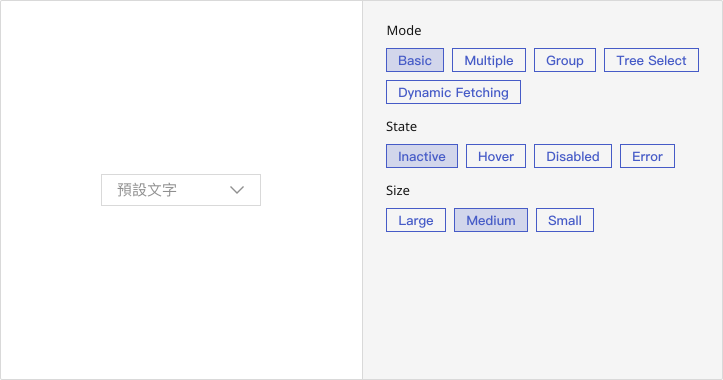
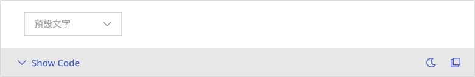
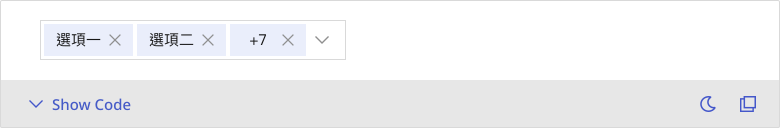
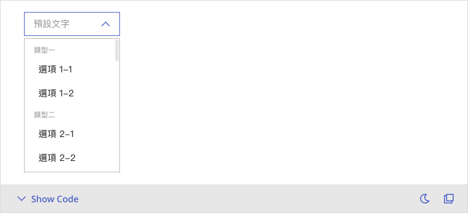
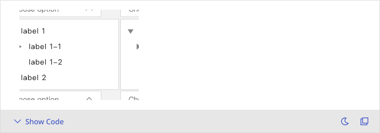
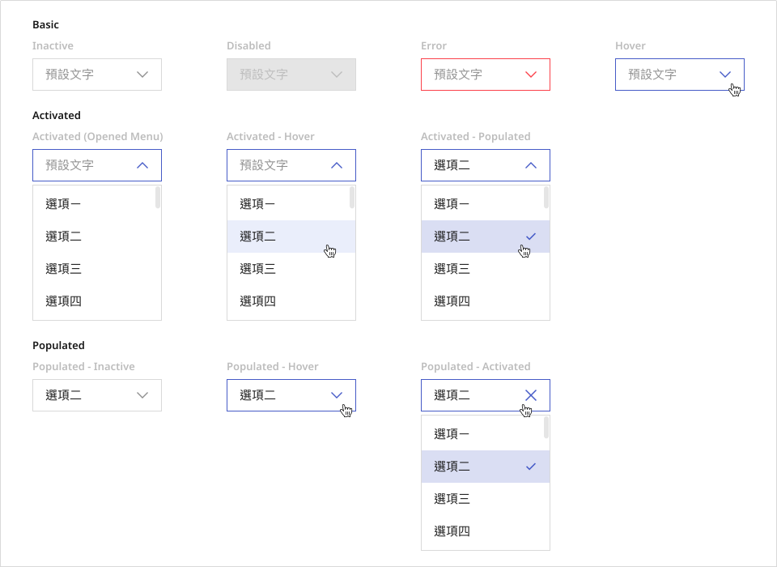
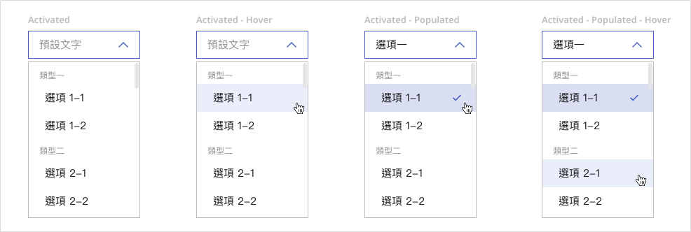
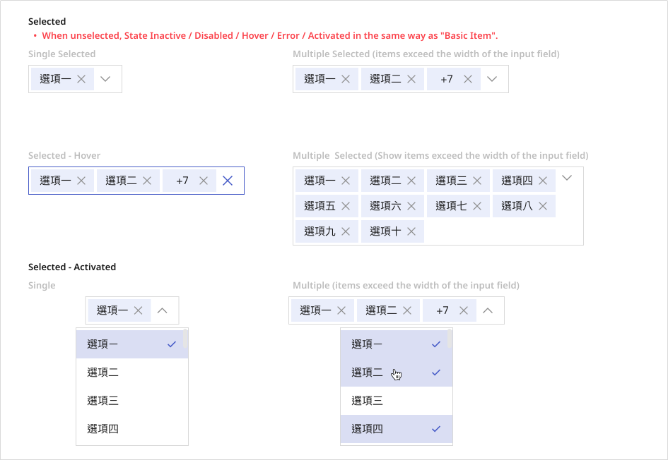
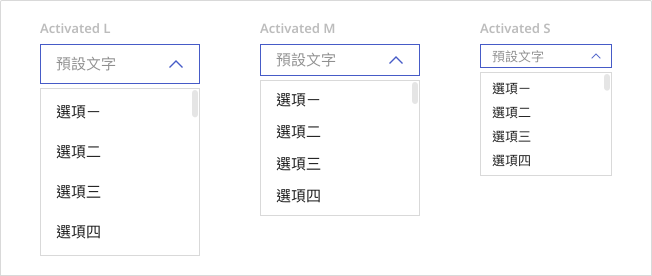

# Select
Select enables users to choose one or more options from a predefined or dynamically loaded list, ideal for scenarios requiring explicit selection from a limited set.

# Playground

## Usage Guide
The Select component is designed to help users efficiently choose from a limited set of options. It supports single and multiple selection, option grouping, and dynamic data loading. Suitable for forms, filters, and configuration settings, it provides various sizes and states, including error feedback and clear actions to enhance usability.

### Best Practices
- **Keep option labels concise**: Avoid overly long text and ensure clarity of each choice.
- **Use grouping for long lists**: Group options when dealing with large sets to improve scannability.
- **Provide contextual placeholder**: Use placeholder text to guide users when no option is selected.
- **Match size to layout needs**: Select the appropriate size (L / M / S) based on interface constraints and priority.
- **Enable clearable for flexibility**: Allow users to clear selections in editable fields to improve control.
- **Ensure consistent click targets**: When customizing option content, preserve predictable interaction areas.
    

### When Not to Use
- **When the option list is very large and needs filtering**: If there are more than 100 items, and users cannot easily scan all choices, consider searchable alternatives like AutoComplete to reduce cognitive load.
- **When users are unfamiliar with the options**: If each option requires explanation to be understood, a simple dropdown may not provide sufficient context. Use descriptive lists or custom panels instead.
- **When high-frequency switching is needed**: Select is suitable for occasional use. For frequent changes (e.g., filter toggles), consider using Radio Groups or Toggle Buttons for quicker interactions.
- **When all options need to be visible for comparison**: In scenarios where users must compare options side-by-side, like preference settings, tables or card-based layouts are often more effective.
- **When used for display only**: If the field is only showing selected data and not meant for interaction, use non-interactive components like Text, Tags, or ReadOnly Input to avoid confusion.
    

### Usage Patterns
- **Open the menu**: Clicking on the input triggers a dropdown menu with a grow transition animation.
- **Clear selected value**: In a populated state, a clear icon (X) appears for removing the current selection.
- **Multi-selection display**: Selected items appear as tags inside the input; overflow content wraps or truncates as needed.
- **Option grouping**: Grouped options are separated by labeled sections to enhance readability.
- **Load more options on scroll**: In dynamic fetching mode, scrolling to the bottom of the menu triggers a loading state to append more options.
- **Error and disabled states**: Invalid or inactive fields will reflect visual feedback (e.g., error, disabled) and block interaction.
	

## Modes
### 1. Basic Selection
Allows users to select a single option. Commonly used in forms and filters, it supports placeholder text, error states, and a clearable icon.

### 2. Multiple Selection
Enables users to select multiple items. Selected options appear as tags within the input. If items exceed the field width, they collapse into a concise format. Suitable for tag management or multi-category selection.

### 3. Option Group
Organizes options into logical groups to enhance readability and navigation. Commonly used for structured datasets such as departments or locations.

### 4. Tree Select
Supports hierarchical data with expandable tree nodes. Users can navigate and select nested items, making it ideal for structures like file systems or organizational charts. Dynamic expansion and level control are supported.

### 5. Dynamic Fetching
Dynamically loads option data via asynchronous calls, often triggered by user input. This is useful for large datasets or typeahead experiences, with optional debounce for performance optimization.

**💡 Note:**  `Full Control` and `On Modal` are special integration contexts handled in the <a href="#integration">**Integration**</a> section to avoid ambiguity in mode classification.

## Appearance
### Anatomy
1. **Input Field**: The main interactive field showing selected value, placeholder, or typed content.
2. **Dropdown Menu**: A list that displays options. The format may vary (list, group, tree) based on mode.
3. **Clear Icon**: Appears when there’s input or a selection, allowing users to clear the value.
4. **Tags (Multiple Mode)**: In multiple selection mode, selected items appear as removable tags.
5. **Suffix Icon / Action**: Custom actions or indicators on the right side (e.g., dropdown arrow, external button).

### States
#### 1. Basic Item
- **Basic**: `inactive`, `hover`, `disabled`, `error`
- **Activated**: `activated`, `activated-hover`, `activated-populated`
- **Populated**: `populated-inactive`, `populated-hover`, `populated-activated`

> 💡 When typing or hovering a pre-filled field, a clear icon (X) appears to allow clearing the content.

#### 2. Option Group
- **Activated Variants**: `activated`, `activated-hover`, `activated-populated`, `activated-populated-hover`

#### 3. Multiple Selection
- **Selected**: `single selected`, `multiple selected (overflow)`, `selected-hover`
- **Activated**: `selected-activated`, `selected-activated-multiple (overflow)`

> 💬 When unselected, the visual behavior matches the Basic Item states.

### Sizes
Supports three sizes:
- `Large`: Increased height and font size.
- `Medium`: Default size for general use.
- `Small`: Compact layout for dense UI areas.

### Transition Animation
- **Grow**: When the menu opens, it fades and expands downward for a smooth appearance.
- **Collapse**: On close, the menu fades out and resets hover states.

### Clear Icon Behavior
- The clear icon appears when:
  - There’s input or selected value
  - The field is hovered or focused
- Clicking the icon resets the value and triggers the clear event (e.g., `onClear`)

> 📌 Behavior differs by mode. In multiple selection, all selected tags will be cleared.

---

## Custom Disable
<!-- 控制使用者在什麼條件下不能使用 -->
The Select and TreeSelect components offer multiple levels of disable control to help restrict user interactions under specific conditions. This section outlines available disable behaviors and implementation guidance.

### Basic Disable
- Use the `disabled` prop to disable the entire field or individual options:
  - `Select` and `TreeSelect` support global field disabling
  - `Option` supports disabling single items

### TreeSelect Only: Disable Nested Options
TreeSelect includes a disabledValues prop that allows disabling multiple nodes by value. It supports the following automatic behaviors:
- If all children are disabled, their parent will automatically be disabled
- If a parent node is disabled, all its descendants will also be disabled

> 💡 Consider using renderValue or treeProps to provide visual cues or helper messages for disabled states.

### Limitations
- Select (non-TreeSelect) does not support disabling options in batch via a value array
- Conditional disable logic (e.g., based on other field values) is not built-in

If conditional disabling is needed, we recommend implementing the logic externally via preprocessing or wrapper components.

## Validation / Restrictions
To ensure consistent interaction and user experience with the **Select** component, proper validation and restriction logic should be applied.\
Select is commonly used for input selection, dynamic data loading, and multi-selection control, making validation of options, access conditions, and value states particularly important.\

The table below outlines key validation items for **Select**, along with responsibilities for designers and developers:

| Item | Description | 🎨 Designer | 🛠️ Developer |
|------|-------------|-------------|---------------|
| **Required Field Logic** | If the select field is required, it should be clearly marked with hints or placeholders. | Provide clear indicators (e.g., asterisk, placeholder, helper text). | Apply validation rules and check for value before submission. |
| **Conditional Menu Access** | The dropdown should be disabled when certain prerequisites are not met (e.g., dependent field is empty). | Indicate disabled state visually and explain why it's inactive. | Use `disabled` or conditional rendering to prevent opening. |
| **Async Loading State** | When loading options from remote sources, show loading, error, or empty states. | Design loading animations and empty state visuals with guidance. | Render appropriate loading/error/empty UI based on fetch state. |
| **Multi-Select Constraints** | In multi-select mode, a maximum selection limit may apply. | Show selection count and visually indicate when the limit is reached. | Enforce selection cap and disable unchecked options if needed. |
| **Validation & Error Feedback** | Clearly indicate errors when input is invalid or missing. | Define error message style and positioning. | Integrate error messages with form logic and apply styling. |

    
## Integration
<!-- 元件「如何與其他應用層、框架、資料結構或函式庫協同工作」的方式 = 怎麼接進系統 -->
### Asset / Style Source
- The visual style of the Select component follows the Mezzanine Design System, including border radius, spacing, typography, and transition animation.
- A grow animation is used when the dropdown opens; avoid overriding it with custom CSS.
- Do not override internal layout or positioning logic to prevent disruption of the dropdown behavior.

### Component Integration Contexts
Select is frequently used in the following integration scenarios:

| Use Case | Integration Purpose |
|--------|--------|
| **Basic Form Selection** | Provides single or multiple selection within forms. |
| **Dynamic Option Fetching** | Loads data from remote sources when the dropdown is opened. |
| **Hierarchical Options (Tree Select)** | Displays nested options for categories, permissions, etc. |
| **Embedded in Modal** | Works seamlessly inside modals or drawers without interaction conflicts. |
| **Full Control Mode** | Externalizes all internal state and logic (e.g., value, menu trigger). |

> ☑️ **Integration Tips:**  
> - For form use cases, prefer controlled components to sync validation and value state.  
> - When used in modals or overlays, ensure the dropdown portal does not obstruct or overlap important UI layers.

### Behavior Delegation
Select supports both controlled and uncontrolled patterns. Logic can be delegated to the parent component as needed:

| Interaction Type | Responsibility |
|--------|--------|
| **Value and onChange** | May be internally or externally controlled via props. |
| **Open/Close State** | In Full Control mode, must be managed explicitly from outside. |
| **Async Option Loading** | Trigger fetch logic in `onOpen` or externally controlled state. |
| **Validation Handling** | Should be managed by the parent or form validation wrapper. |

### Rendering / Performance Considerations
- Dropdown content is rendered only when visible, optimizing initial load performance.
- In multiple selection mode, selected tags are clipped or scrolled when exceeding the input width.
- For large datasets, consider using virtual scroll or chunked loading.

### Library / Data Dependency
- Does not rely on external data schema or third-party libraries.
- Supports asynchronous loading and mapping of custom data structures (e.g., differing `value`, `label`, `id` fields).
- Integrates well with form libraries like React Hook Form, Zod, or Yup.

## Props Overview
<!-- Appearance 控制外型、Behavior 控制互動行為、Data 資料處理、Validation 驗證相關、Events 事件回呼、Integration 整合支援 --> 
### Appearance
Manages the visual presentation and layout of the component, including size, style variants, icon placement, spacing, and visibility states. These settings ensure consistency with the design system and help maintain visual hierarchy across the interface.

| Property | Description | Type | Default |
|-------|-------|-------|-------|
| **size** (Select, TreeSelect) | The size of input. | `"small"` `"medium"` `"large"` | - |
| **fullWidth** (Select, TreeSelect) | If `true`, set width: 100%. | `boolean` | `false` |
| **className** (Select, TreeSelect) | Custom class name. | `string` | - |
| **prefix** (Select, TreeSelect) | The prefix addon of the field. | `ReactNode` | - |
| **suffixActionIcon** (Select, TreeSelect) | Icon rendered on the right side. | `ReactElement<HTMLElement, string , JSXElementConstructor<any>>` | - |
| **forceHideSuffixActionIcon** (Select, TreeSelect) | Force hiding suffix icon. | `boolean` | - |
| **ellipsis** (Select, TreeSelect) | Tags arg ellipsis or not. | `boolean` | - |
| **placeholder** (Select, TreeSelect) | Select input placeholder. | `string` | - |

### Behavior
Controls the interactive behavior of the component, such as handling user actions, managing component states (e.g., loading, toggling), and enabling mode switching to support different usage scenarios.
        
| Property | Description | Type | Default |
|-------|-------|-------|-------|
| **clearable** (Select, TreeSelect) | Whether to show the clear button. | `boolean` | `false` |
| **disabled** (Select, TreeSelect, Option) | Whether the field is disabled. | `boolean` | `false` |
| **mode** (Select, TreeSelect) | Controls the layout of trigger. | `"multiple"` `"single"` | - |
| **disablePortal** (Select, TreeSelect) | Whether to disable portal. If true, it will be a normal component. | `boolean` | `false` |
| **defaultExpandAll** (TreeSelect) | Controls whether to expand all at first render. | `boolean` | - |
| **sameWidth** (TreeSelect) | If true, the panel will have its min-width be same as the trigger width. | `boolean` | `false` |
| **active** (Option) | Whether the menu item is active. | `boolean` | `false` |

        
### Data
Handles the structure, input, and display of data within the component, including content rendering, default values, and formatting. Ensures the component properly reflects and updates data as expected.

| Property | Description | Type | Default |
|-------|-------|-------|-------|
| **value** (Select, TreeSelect, Option) | The value of selection. | `SelectValue<string>, SelectValue<string>[], null` | `undefined undefined` |
| **defaultValue** (Select) | Default selection value. | `SelectValue<string>, SelectValue<string>[]` | - |
| **options*** (TreeSelect) | The nested options for `TreeSelect`. | `TreeSelectOption<string>[]` | - |
| **label** (OptionGroup) | The label of menu item group. | `ReactNode` | - |
| **children*** (Option) | option children (often means the option name) | `string` | - |
| **depth** (TreeSelect) | TreeSelect option depth for layout. | `number` | - |
| **menuProps** (TreeSelect) | Other props you may provide to `Menu`. | `Omit<MenuProps, "role", "size", "itemsInView", "maxHeight">` | - |
| **treeProps** (TreeSelect) | Other props you may provide to `Tree`. | `Omit<TreeProps, "onSelect", "values", "selectable", "defaultExpandAll", "selectMethod", "onExpand", "disabledValues", "expandControllerRef", "expandedValues", "nodes">` | - |

### Validation
Defines validation rules for the component, such as required fields, input constraints, or allowed ranges, to ensure data accuracy and prevent user errors.

| Property | Description | Type | Default |
|-------|-------|-------|-------|
| **required** (Select, TreeSelect) | Whether the selection is required. | `boolean` | `false` |
| **error** (Select, TreeSelect) | Whether the field is error. | `boolean` | `false` |
| **disabledValues** (TreeSelect) | Disable specific tree nodes. | `TreeNodeValue[]` | - |
| **role** (Option) | The role of menu item. | `string` | `"'option'"` |
| **menuRole** (Select, TreeSelect) | The role of menu. | `string` | `"'menu'"` |

### Events
Specifies event callbacks triggered by user interactions (e.g., onChange), allowing the component to communicate with external systems or trigger further processing logic.

| Property | Description | Type | Default |
|-------|-------|-------|-------|
| **onChange** (Select, TreeSelect) | The change event handler of input element. | `((newOptions: SelectValue<string>[]) => any), ((newOptions: SelectValue<string>) => any)` | - |
| **onClear** (Select, TreeSelect) | The callback will be fired after clear icon clicked. | `MouseEventHandler` | - |
| **onTagClose** (Select, TreeSelect) | The click handler for the cross icon on tags. | `((target: SelectValue<string>) => void)` | - |
| **onFocus** (Select, TreeSelect) | Focus events. | `VoidFunction` | - |
| **onBlur** (Select, TreeSelect) | Blur events. | `VoidFunction` | - |
| **onExpand** (TreeSelect) | Tree node expansion event. | `((value: TreeNodeValue) => void)` | - |
| **expandControllerRef** (TreeSelect) | Provide if access to expand control is needed. | `Ref<TreeExpandControl, null>` | - |
| **onMenuScroll** (Select) | Popup menu scroll listener. | `((computed: { scrollTop: number; maxScrollTop: number; }, target: HTMLUListElement) => void)` | - |
| **inputRef** (Select, TreeSelect) | The ref object for input element. | `Ref<HTMLInputElement>` | - |

### Integration
Provides configuration options for integrating with external systems, utilities, or libraries, ensuring compatibility with project-specific requirements such as formatting, localization, or third-party tools.

| Property | Description | Type | Default |
|-------|-------|-------|-------|
| **renderValue** (Select, TreeSelect) | To customize rendering select input value. | `(((values: SelectValue<string>, SelectValue<string>[], null) => string) & ((values: SelectValue<string>[]) => string)), (((values: SelectValue<string>, SelectValue<...>[], null) => string) & ((values: SelectValue<...>, null) => string))` | - |
| **searchText** (Select, TreeSelect) | Used for custom search behavior. | `string` | - |
| **showTextInputAfterTags** (Select, TreeSelect) | Used for custom search behavior. | `boolean` | - |
| **popperOptions** (Select, TreeSelect) | The options of usePopper hook of react-popper. | `PopperOptions<any>` | - |
| **itemsInView** (Select, TreeSelect) | The minimum items count in scroll container. | `number` | `4;` |
| **menuMaxHeight** (Select, TreeSelect) | The custom menu max height. | `number` | - |
| **menuSize** (Select, TreeSelect) | The size of menu. | `"small"` `"medium"` `"large"` | `"'medium'"` |
| **suffixAction** (Select, TreeSelect) | Custom component near suffix area. | `VoidFunction` | - |
