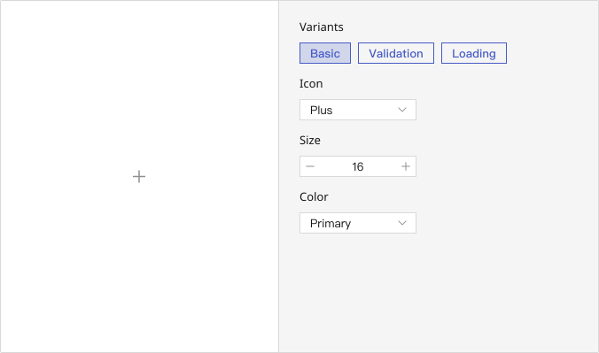

# Select

## Playground

## Usage Guide

    ### Best Practices
    -
    

    ### When Not to Use
    -
    

    ### Action Flow
    1. 
	

## Modes
    ### 
        - 

    ### 
        - 

    ### 
        - 

    ### 
        - 

    
    

## Appearance
    ### Anatomy
    

    ### Color Variants
    

    **📌 Note:**  

        

    ### States
        

    ### Sizes

---

## Custom Disable
    <!-- 控制使用者在什麼條件下不能使用 -->
    

## Validation / Restrictions
    To ensure accurate semantic expression, consistent interactions, and accessibility across the interface, it is important to define validation and restriction rules for how icons are used.\
    These checks help prevent incorrect usage, maintain a coherent user experience, and support both design and engineering alignment.\

    The table below outlines common validation items for **???**, along with their primary audience (Designer / Developer):
    | Item | Description | 🎨 Designer | 🛠️ Developer |
    |-------|-------|-------|-------|
    |  |  |  |  |
    |  |  |  |  |

    
## Integration
     <!-- 元件「如何與其他應用層、框架、資料結構或函式庫協同工作」的方式 = 怎麼接進系統 -->
    ### 

## Props Overview
     <!-- Appearance 控制外型、Behavior 控制互動行為、Data 資料處理、Validation 驗證相關、Events 事件回呼、Integration 整合支援 --> 
    ### Appearance
        Manages the visual presentation and layout of the component, including size, style variants, icon placement, spacing, and visibility states. These settings ensure consistency with the design system and help maintain visual hierarchy across the interface.

        | Property | Description | Type | Default |
        |-------|-------|-------|-------|
        | **** |  | `` |  |
        | **** |  | `` |  |
        

    ### Behavior
        Controls the interactive behavior of the component, such as handling user actions, managing component states (e.g., loading, toggling), and enabling mode switching to support different usage scenarios.
        
        | Property | Description | Type | Default |
        |-------|-------|-------|-------|
        | **** |  | `` |  |

        
    ### Data
        Handles the structure, input, and display of data within the component, including content rendering, default values, and formatting. Ensures the component properly reflects and updates data as expected.

        | Property | Description | Type | Default |
        |-------|-------|-------|-------|
        | **** |  | `` |  |

    ### Validation
         Defines validation rules for the component, such as required fields, input constraints, or allowed ranges, to ensure data accuracy and prevent user errors.

        | Property | Description | Type | Default |
        |-------|-------|-------|-------|
        | **** |  | `` |  |

    ### Events
        Specifies event callbacks triggered by user interactions (e.g., onChange), allowing the component to communicate with external systems or trigger further processing logic.

        | Property | Description | Type | Default |
        |-------|-------|-------|-------|
        | **** |  | `` |  |

    ### Integration
        Provides configuration options for integrating with external systems, utilities, or libraries, ensuring compatibility with project-specific requirements such as formatting, localization, or third-party tools.

        | Property | Description | Type | Default |
        |-------|-------|-------|-------|
        | **** |  | `` |  |