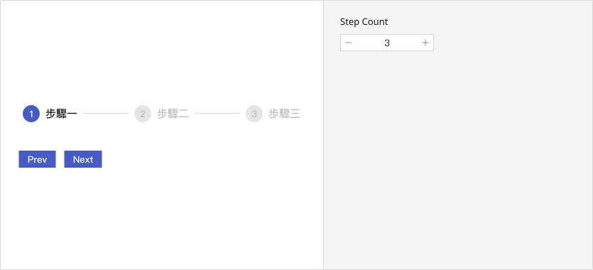

# Stepper
Steppers guide users through multi-step processes such as forms, tasks, or workflows.

## Playground

**📌 Note:** Direct step navigation via clicking is not supported at this time, nor are “Prev” and “Next” buttons built into the component. These interactions should be implemented within the parent container component for greater flexibility and control.

## Usage Guide
Stepper is best suited for task-oriented interfaces such as forms, registration flows, or guided setup processes, where users are expected to complete steps sequentially. Each step reflects its state—completed, active, or upcoming—through distinct visual styles. Currently, the component supports only horizontal layouts and does not include step descriptions or error indicators.

    ### Best Practices
    - **Ideal for clearly defined linear flows:** Use Stepper for tasks that require sequential progression, such as multi-page forms, onboarding wizards, or account setup.
	- **Integrate with form validation:** Control step transitions based on form validation outcomes to ensure data integrity and guide users through each phase confidently.
	- **External navigation control:** Manage user interactions with separate navigation buttons (“Previous”, “Next”) to maintain clear, centralized state management.
	- **Future-proof with step-click support:** Though step navigation via click is not currently available, it is advisable to design with this flexibility in mind for potential future enhancements.
    

    ### When Not to Use
    - **Non-linear workflows:** Avoid using Stepper if the steps do not need to be completed in order, as it may introduce unnecessary constraints.
	- **Minimal step counts:** For processes involving only one or two steps, Stepper can appear excessive and over-designed.
	- **Limited screen space:** Due to its horizontal structure, Stepper may not render well on smaller screens or within compact layouts such as modals.
    

    ### Usage Patterns
    - **Controlled component behavior:** Stepper does not manage its own interaction logic (e.g., advancing to the next step); instead, the current step (`activeStep`) should be managed externally.
	- **Delegate state control to container:** Integrate Stepper with parent logic—typically involving form state and validation—to determine eligibility for proceeding to the next step.
	- **Step click behavior (anticipated):** While step nodes are not currently interactive, design with potential future enhancements in mind—especially for workflows that benefit from quick navigation or step reviews.
	- **Form and validation integration:** Common use cases include registration flows, multi-page setup forms, and application processes, where validation gates each stage of progression.
	- **Extendibility for messages and feedback:** The current design supports only visual status indicators (completed, active, future). If needed, consider allowing space for custom step descriptions or error messaging to enhance usability.
	

## Modes
    The Stepper component offers various operational modes to accommodate different types of workflows. Below are common usage scenarios to help you determine the most suitable guiding mechanism based on your task’s nature.

    ### Linear
        - Guides users through a strict, step-by-step flow. Users must complete each step before progressing to the next.
	    - Recommended For: Forms, onboarding processes, or verification flows that require input in a specific order.

        📌 This is the most commonly used mode for validation-driven processes.

    ### Non-linear
        - Allows users to navigate freely between steps, regardless of completion status. Stepper serves as both navigation and status indicator.
	    - Recommended For: Settings pages, editable summaries, or tasks where step order is flexible.

        📌 Consider visually indicating which steps are completed, active, or incomplete to avoid user confusion.

    ### Progress-only
	    - Displays the current step and overall progress without user interaction. Steps are not clickable, and no active state transition is expected.
	    - Recommended For: Mobile wizards, read-only flows, or when interactions are managed outside the component (e.g., auto-step logic).

        📌 Ideal when using Stepper as a passive progress tracker.

        
    ### Optional Step
	    - Represents steps that are not required to complete the entire process. These steps may be skipped or revisited.
	    - Recommended For: Flows that include conditional questions, add-on sections, or user-preference configurations.

        📌 Make sure to clearly indicate optionality via labeling (e.g., “Optional”) or visual styling.
    

    ### Controlled
        - The Stepper’s state (e.g., active step) is fully managed by the parent component, allowing conditional navigation, validation, or permission gating.
	    - Recommended For: Integration with forms, APIs, or business logic.

        📌 This is the default integration mode. Developers must handle step transitions via props and events.

    
    

## Appearance
    ### Anatomy
        1. **Step Container:** A horizontal track that houses all step elements. It provides visual structure and guides users through a defined process.
	    2. **Step Indicator:** A circular element at the top of each step, visually represents step status using a number or icon (e.g., a checkmark).
	    3. **Step Label:** Positioned below the indicator, this optional label helps describe the content or purpose of the step (e.g., “Basic Info”).
	    4. **Connector Line:** A horizontal line that links adjacent steps, visually conveying progression from one step to the next.

    ### Variants
        Stepper currently supports only a single visual style. Rather than providing multiple appearance variants (e.g., primary, outlined), it focuses on consistent clarity and progression. Future visual modes (e.g., vertical layout, icon-enhanced steps) can be introduced if necessary, but are not available in the current version.

    ### States
        Stepper uses three visual states to represent user progress through a process:
	    - Inactive: Represents steps that have not yet been reached. Displayed as a gray circle with a dark gray number.
	    - Active: Indicates the current step the user is on. Displayed as a blue circle with a white number.
	    - Checked (Completed): Marks steps that the user has successfully passed. Displayed as a blue circle containing a white checkmark icon.

    ### Sizes
        Stepper does not currently offer size variants such as small, medium, or large. The component is designed to visually align with common layout widths and provide a balanced experience across standard form flows or multi-step interfaces.

    ### Layout
        Stepper is designed with a **horizontal layout**, ideal for positioning at the top of a page as a visual progress indicator. This arrangement effectively communicates the current stage and overall flow of a process. If future design and engineering support for vertical layout is added, Stepper may be extended to sidebars or form sections, with structural and layout adjustments according to orientation.

---

## Custom Disable
    <!-- 控制使用者在什麼條件下不能使用 -->
    At present, the Stepper component does not support disabling individual steps. Step states—“upcoming,” “active,” and “completed”—are automatically managed by the `activeStep` index.

    If there is a need to disable specific steps based on business logic (e.g., unmet conditions or incomplete data), we recommend discussing the following potential extensions with the engineering team:
	- Support for `disabledSteps` or `isStepDisabled(index)` logic controls.
	- Addition of an API such as `<Step disabled />` to override default behaviors.

## Validation / Restrictions
    To ensure procedural accuracy and data integrity, the Stepper component should be paired with robust validation and restriction mechanisms.\
    These safeguard the user journey by preventing premature progression, illogical transitions, or incomplete submissions.\

    The table below outlines common validation items for **Stepper**, along with their primary audience (Designer / Developer):
    | Item | Description | 🎨 Designer | 🛠️ Developer |
    |-------|-------|-------|-------|
    | **Required Steps** | Certain steps are mandatory and must not be skipped. | Clearly indicate which steps are required, using symbols (e.g., asterisks) or explanatory text. | Enforce logic that prevents submission before required steps are completed; show appropriate error messages. |
    | **Sequential Flow** | Users must proceed through steps in order. | Use design cues to subtly guide users through the intended flow. | Disable or lock steps that should not yet be accessible to prevent out-of-sequence navigation. |
    | **Conditional Progression** | Some steps depend on the outcome of prior steps. | Reflect dependencies in the user journey, such as optional branches or conditional paths. | Dynamically control visibility and availability of subsequent steps based on earlier inputs. |
    | **Data Completeness** | Prevent users from advancing with incomplete information. | Visually indicate incomplete steps and provide clear prompts. | Validate data at each step and block progression until requirements are met. |
    | **Custom Navigation Restrictions** | Some steps may be locked due to specific business logic. | Clearly mark steps as read-only or inaccessible when needed. | Implement logic (e.g., via props) to disable steps conditionally. |
    | **Submission Blocking** | Prevent the process from being submitted prematurely. | Provide clear UI feedback when submission conditions are unmet. | Aggregate step statuses and ensure all validations pass before final submission. |

    
## Integration
     <!-- 元件「如何與其他應用層、框架、資料結構或函式庫協同工作」的方式 = 怎麼接進系統 -->
    ### Asset / Style Source
        - The Stepper’s visual elements (e.g., circle nodes, connecting lines, check icons) are derived from the Mezzanine Design System using official design tokens and icon sets.  
        - The check icon used in completed steps is rendered using the `Check` icon from the Mezzanine Icon Library. Avoid using third-party or non-standard icons.  
        - Maintain consistent spacing, stroke width, and alignment as defined in the design specifications to avoid visual misplacement due to nested or overridden styles.

    ### Component Integration Contexts
        Stepper is typically used in the following scenarios to help users navigate multi-step flows and understand their current progress:

        | Use Case | Integration Purpose |
        |-------|-------|
        | **Form Flows** | Break down long forms (e.g., sign-ups, applications) into smaller, progressive steps. |
        | **Module Onboarding** | Guide users through setup processes or import flows with sequential instructions. |
        | **Multi-Page Flows** | Display progress across different pages, often integrated with routing or tab systems. |

        > ☑️ **Integration Tips**:  
        > - Do not use Stepper as a substitute for tabs—tabs and steppers serve different interaction patterns and semantic roles.  
        > - When placed at the top of the page, ensure consistent spacing with page titles and action bars.

    ### Behavior Delegation
        The Stepper does not include built-in logic for step progression or validation. External parent components must handle the following:

        | Action Type | Responsibility |
        |-------|-------|
        | **Step Switching Logic** | Control whether users can advance or go back based on validation or custom rules. |
        | **State Management** | Use the `activeStep` prop to track the current step and update completed or disabled steps accordingly. |
        | **Click Event Handling** | If steps are clickable, handle the routing or step-switching logic externally. |
        | **Form Validation Binding** | Integrate with form validation logic per step and determine when to block progression or display errors. |

        > Can be used with form libraries such as React Hook Form or Formik. The parent container should manage step switching based on validation results.

    ### Rendering / Performance Considerations
        - Stepper is a static, presentational component. It only re-renders based on changes to `activeStep` and does not maintain its own state.  
        - Each `<Step />` component can be independently managed and conditionally rendered, enabling modular control of step-specific content.  
        - For heavy content within each step, consider lazy loading or conditional rendering to minimize initial load time.

    ### Library / Data Dependency
        - The Stepper has no inherent dependency on external libraries or data formats.  
        - When used with routers (e.g., React Router), each step can be mapped to a route param to enable deep linking and state synchronization.  
        - For complex step flows (e.g., onboarding, multi-step forms), consider managing state using Context, Redux, or URL parameters to persist progress.

## Props Overview
     <!-- Appearance 控制外型、Behavior 控制互動行為、Data 資料處理、Validation 驗證相關、Events 事件回呼、Integration 整合支援 --> 
    ### Appearance
        *Currently, all visual styles of the Stepper component are predefined. There are no exposed props such as variant or size available for external customization.*
        

    ### Behavior
        Controls the interactive behavior of the component, such as handling user actions, managing component states (e.g., loading, toggling), and enabling mode switching to support different usage scenarios.
        
        | Property | Description | Type | Default |
        |-------|-------|-------|-------|
        | **activeStep** (Stepper, Step) | Set the active step (zero based index) and set other `<Step />` to completed or disabled depending on index. Set to -1 to disable all the steps. | `number` | `-1` |

        
    ### Data
        Handles the structure, input, and display of data within the component, including content rendering, default values, and formatting. Ensures the component properly reflects and updates data as expected.

        | Property | Description | Type | Default |
        |-------|-------|-------|-------|
        | **children*** (Stepper, Step) | Two or more `<Step />` components. | `ReactNode` | - |

    ### Validation
         *Stepper does not handle internal validation logic. It relies entirely on external containers (such as forms) to determine whether users can proceed to the next step or not.*

    ### Events
        *At present, the Stepper component does not expose event handlers like `onChange` or `onClickStep`. To enable step navigation via user clicks, external logic must be implemented to control the active step manually.*

    ### Integration
        *Stepper is typically integrated in forms, onboarding flows, or setup wizards where step-by-step progression is required. It does not manage form state, data validation, or routing. These responsibilities must be handled by the parent component or associated libraries.*
        