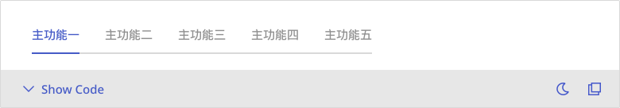
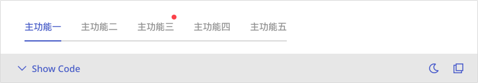
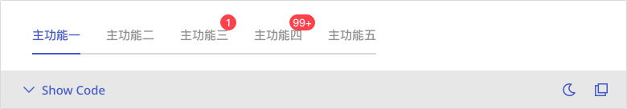
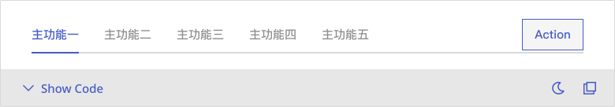
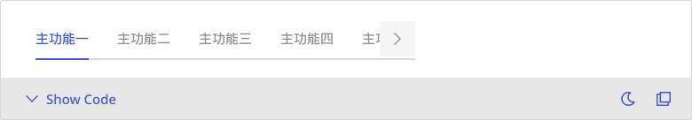

# Tabs
Tabs allow users to switch between related views or content categories within the same page.


## Playground


## Usage Guide
    The Tabs component is well-suited for scenarios involving information categorization, content segmentation, or multi-view toggling. Users can navigate between content panels by selecting different tab labels. The component supports both basic and grouped styles, enhanced with optional features such as numeric indicators, badges, auxiliary buttons, and horizontal scrolling. It also provides distinct visual cues for various interaction states, including disabled, hover, and selected.

    ### Best Practices
    - **Use for switching between related peer-level content:** Tabs are ideal when users need to navigate between parallel sections of information—such as form segments, filter options, or dashboard panels—offering a clear and unobtrusive way to switch views.
	- **Maintain page stability:** Content under each tab should switch within the same layout block without triggering a full page reload or navigation, ensuring a seamless user experience.
	- **Provide contextual enhancements as needed:** Supplementary elements like counters, badges, or action buttons (e.g., to display pending items or trigger additions) can be incorporated alongside tabs to enhance clarity or control.
	- **Handle overflow gracefully:** When the number of tabs exceeds the container width, enable horizontal scrolling or display navigation arrows to prevent text truncation and layout disruption.
    

    ### When Not to Use
    - **Low contextual relevance between content:** If the information under each tab is loosely related or independent, using tabs may confuse users and obscure the overall content structure.
	- **Deeply nested layouts:** Avoid adding tabs within interfaces already using complex navigation components (e.g., sidebars, accordions), as it may overwhelm users and increase cognitive load.
	- **Excessive number of tabs:** When the number of tabs exceeds 7–8 items, consider restructuring the content or using alternatives like dropdowns to avoid visual clutter and usability issues.
    

    ### Usage Patterns
    - **Immediate content switching:** Clicking on a tab should instantly display the corresponding content without requiring further confirmation, ensuring responsiveness and alignment with user expectations.
	- **Support for disabled tabs:** Tabs can be configured as non-interactive (disabled), commonly used to indicate unavailable steps or restricted sections based on current user context.
	- **No external state control by default:** The Tabs component currently does not expose a standardized external state control interface. Tab selection is managed internally, though activeKey can be used for manual overrides.
	- **Integrate with loading or skeleton states:** For content that involves data fetching or complex rendering, use loading spinners or skeleton screens to provide visual feedback during transitions.
	- **Simple foundation with flexible extension:** While Tabs are a fundamental component, they support enhanced UI elements such as badges, dots, and action buttons, allowing for contextual customization according to design needs.
	


## Modes
    Tabs offer a variety of configurations tailored to different content types, usage goals, and interaction frequencies. Each mode is built upon the basic Tab component and can be extended with informative cues (such as badges or numbers), functional controls (such as buttons), or interactive behavior (such as scrollable navigation):

	### Default 
    - Presents standard category switching without extra indicators or actions. Ideal for general UI layouts or form section separation.
	- Recommended For: Simple navigation interfaces where tabs act purely as content containers.

    📌 This is the most common mode and serves as the foundation for other extended patterns.
    
    

	
    ### With Badge
    - Displays a small dot on the top-right corner of the tab, signaling pending updates or unread content.
	- Recommended For: Notification panels, message centers, or task systems where visual cues are needed to attract user attention.

    📌 Use badges sparingly to avoid overwhelming users with too many visual alerts.

    


    ### With Number
    - Shows numerical indicators on each tab to represent data volume or item counts.
	- Recommended For: Management dashboards, filtering tools, or form-based content grouped by type.

    📌 Helps users quickly grasp the distribution or importance of tab contents.

    

	
    ### With Action Button
    - Includes a functional button (e.g., add, import) aligned to the right of the tab group for direct access to related actions.
	- Recommended For: Admin tools, frequent content creation interfaces, or settings panels with high user interaction.

    📌 Action buttons are typically large-sized and styled as tertiary buttons for visual balance.

    


    ### Overflow
    - Enables horizontal scrolling or directional arrows when the tab count exceeds available space.
	- Recommended For: Interfaces with many categories such as analytics dashboards or multi-section pages.

    📌 Make sure the navigation controls remain visible and intuitive, especially on smaller screens.

    
   
    


## Appearance
    ### Anatomy
        1. **Tab Group Container:** The outer wrapper that arranges all tabs, typically in a horizontal row. When the number of tabs exceeds the available width, overflow behavior—such as scroll or arrow navigation—is triggered.
	    2. **Tab Label:** The primary clickable area of each tab. The label is usually text-based and may include icons or follow custom alignment and layout rules.
	    3. **Indicator:** A visual underline that highlights the currently active tab. Its style or animation may vary depending on the selected variant.
	    4. **Dot Badge / Number Badge (Optional):** Small status indicators such as a red dot or numeric count, positioned at the top-right corner of the tab to signal notifications or item counts.
	    5. **Action Button (Optional):** Additional actions like “Add”, “Import”, or “Edit” appear on the right side of the tab group, especially in With Action Button mode. Typically styled as Tertiary and sized Large.


    ### States
        - **Enabled:** The default state. Tabs are clickable and responsive.
	    - **Hovered:** On mouse hover, visual feedback is provided through changes in text color or underline color.
	    - **Selected / Active:** Indicates the currently active tab, typically styled with a high-contrast label and visible indicator (such as an underline or highlight).
	    -**Disabled:** A non-interactive state, often used for tabs that are not yet accessible. These tabs are usually shown with reduced opacity and without hover effects.
	    - **With Notification (Badge):** Whether selected or not, badges should remain clearly visible to draw attention. Red or accent colors are commonly used for emphasis.


    ### Layout
        Tabs are often placed at the top of a content section and must align well with the overall visual hierarchy:
	    - **Alignment:** Tabs are left-aligned by default. For single-focus layouts (e.g., settings pages), center alignment may be used to highlight the primary navigation.
	    - **Wrap / No-wrap:** Tab labels are displayed in a single line by default. For lengthy text, truncation via ellipsis is recommended to maintain layout integrity.
	    - **Fixed / Dynamic Width:** Tabs are dynamically sized based on their content by default. For uniform width across tabs, fixed-width designs should be specified in the design mockups.


    ### Responsive Behavior
        Tabs should provide a seamless experience across devices:
	    - **Desktop:** All tab categories are shown in full. If the total width exceeds the container, scrollable or arrow-based navigation should be enabled.
	    - **Tablet / Mobile:** Scrollable tab strips or dropdown menus are recommended to prevent label wrapping or overlap.

        📌 Responsive behavior is closely tied to the Overflow mode. Please align with development teams to define the exact behavior and breakpoint logic.


---


## Custom Disable
    <!-- 控制使用者在什麼條件下不能使用 -->
    The Tabs component allows individual `<Tab>` elements to be disabled via the `disabled` attribute, thereby preventing interaction with specific tabs. When a tab is disabled, it is rendered in a visually inactive state and cannot be activated through user input.

    ### Usage
	- Assigning `disabled={true}` to a `<Tab>` will automatically render it unselectable.
	- Disabled tabs typically appear in grayscale, with a `not-allowed` cursor, and do not trigger any `onChange` events.
	
    ### Conditional Disabling
	- When the disabled state needs to reflect external conditions—such as user permissions or procedural requirements—the boolean value of `disabled` can be programmatically determined:
    ```tsx
      <Tab disabled={userRole !== 'admin'}>Admin Settings</Tab>
    ```

    ### Advanced: Blocking Interaction Without Using disabled
	To preserve the interactive appearance while preventing tab switching—such as requiring a prior step to be completed—you may:
	    - Omit the `disabled` attribute and instead handle conditional logic within the `onChange` event
	    - Pair the logic with a Tooltip to explain the restriction

    ---
    📌 Recommendation: When the disabling logic is dynamic (e.g., based on form state or backend permissions), delegate the conditional control to the parent component to avoid coupling business logic with the UI layer.

## Validation / Restrictions
    To ensure correct interaction and predictable behavior when using the **Tabs** component, it's essential to apply appropriate validation and restriction logic.\
    These measures help prevent users from accessing tabs prematurely, viewing unintended content, or performing invalid actions.This section highlights common validation scenarios specific to Tabs, especially in contexts involving conditional navigation, access control, or dependent data states.

    The table below outlines key validation items for **Tabs**, along with the corresponding responsibilities for designers and developers:
    | Item | Description | 🎨 Designer | 🛠️ Developer |
    |-------|-------|-------|-------|
    | **Disabled Tabs** | Certain tabs may need to be temporarily disabled due to state, permissions, or business rules. | Visually indicate disabled state (e.g., dimmed appearance, `not-allowed` cursor) and provide tooltips or helper text. | Use `disabled` props or custom logic to prevent interaction. |
    | **Conditionally Visible Tabs** | Not all tabs are shown at once. Visibility may depend on user roles or application data. | Define rules for which tabs should appear based on context. | Conditionally render `<Tab>` components depending on logic or external data. |
    | **Tab Access Restriction** | Users may be prevented from switching to certain tabs until specific requirements are met (e.g., incomplete steps). | Use visual cues (e.g., tooltip, icon) to indicate restricted access. | Intercept `onChange` or control tab navigation via parent logic. |
    | **Data-Driven Availability** | The availability or behavior of tabs may depend on data completeness or validation. | Use visual feedback to reflect pending, incomplete, or error states. | Dynamically enable/disable tabs or modify tab content based on state. |
    | **Error-Blocking Navigation** | Prevent switching to another tab if validation fails or data is not saved. | Clearly indicate error and guide the user to stay on the current tab. | Block tab change action and display relevant error messages or revert behavior. |

    
## Integration
     <!-- 元件「如何與其他應用層、框架、資料結構或函式庫協同工作」的方式 = 怎麼接進系統 -->
    ### Asset / Style Source
    - The visual styling of the Tabs component adheres to the Mezzanine Design System, encompassing elements such as the underline indicator, active state highlights, and typeface specifications.
    - For icon-enhanced tabs, utilize icons exclusively from the Mezzanine Icon Library. The use of third-party or unvetted icons is discouraged unless explicitly approved by the design team.
    - Ensure proper spacing between tabs, consistent indicator thickness, and alignment precision as outlined in the design documentation. Avoid visual inconsistencies caused by style overrides or nested component interference.

    ### Component Integration Contexts
    Tabs are widely employed to facilitate category-based segmentation, modular content access, and contextual display toggling. Common integration scenarios include:
    | Use Case | Integration Purpose |
    |-------|-------|
    | **Content Segmentation** | Enables users to navigate between discrete topics or categories (e.g., user settings, card content). |
    | **Modular Interfaces** | Separates functional areas (e.g., permissions, profile settings, notification preferences) into manageable views. |
    | **Data Perspective Switching** | Allows toggling between different data scopes (e.g., daily / monthly / yearly reports) for better focus and comparison. |
    | **Embedded Interfaces** | Used within cards or dialogs to switch content contextually without occupying additional space. |

    > ☑️ **Integration Tips**:  
    > - Tabs are intended for non-linear content groupings. For sequential workflows, use a Stepper component instead.  
    > - When tabs exceed available space, apply horizontal scrolling or overflow handling to preserve layout integrity.

    ### Behavior Delegation
    Tabs do not manage state or internal logic. Behavioral control must be delegated to the parent context:
    | Interaction Type | Responsibility |
    |-------|-------|
    | **Tab Switching Logic** | The parent component should manage `activeKey` or equivalent to reflect the selected tab. Use `onChange` to trigger logic updates. |
    | **Click Event Handling** | Intercept tab switches to apply conditional checks (e.g., unsaved changes, permission restrictions) before proceeding. |
    | **Conditional Rendering / Disabled States** | Tabs can be dynamically hidden or disabled based on external conditions; such control should reside in the parent layer. |
    | **State Synchronization** | If tabs correspond to route parameters (e.g., `?tab=overview`), synchronize state with routing or context accordingly. |

    > Can be integrated with state management solutions like React Router, Redux, or Zustand to maintain predictable application state.

    ### Rendering / Performance Considerations
    - Tabs only render the tab labels and interactive shell; the content behind each tab must be handled externally.
    - For performance-sensitive scenarios, especially with heavyweight content, implement lazy rendering to defer loading until the tab is activated.
    - When tabs are numerous, avoid pre-rendering all tab content. Consider virtualization or conditional mounts to minimize initial render load.

    ### Library / Data Dependency
    - Tabs have no intrinsic dependency on data shape or external libraries. They can be paired freely with routing systems or state management libraries.
    - For server-driven content, bind data-fetching logic to tab change events to load only necessary resources.
    - If used in a permission-controlled environment, restrict access to specific tabs via the `disabled` or `hidden` state based on user roles or access levels.


## Props Overview
     <!-- Appearance 控制外型、Behavior 控制互動行為、Data 資料處理、Validation 驗證相關、Events 事件回呼、Integration 整合支援 --> 
    ### Appearance
        Manages the visual presentation and layout of the component, including size, style variants, icon placement, spacing, and visibility states. These settings ensure consistency with the design system and help maintain visual hierarchy across the interface.

        | Property | Description | Type | Default |
        |-------|-------|-------|-------|
        | **tabBarClassName** (Tabs) | The className of tabBar. | <font color="#BD3B3B">`string`</font> | - |
        

    ### Behavior
        Controls the interactive behavior of the component, such as handling user actions, managing component states (e.g., loading, toggling), and enabling mode switching to support different usage scenarios.
        
        | Property | Description | Type | Default |
        |-------|-------|-------|-------|
        | **activeKey** (Tabs) | Current TabPane's index. | <font color="#BD3B3B">`Key`</font> | - |
        | **defaultActiveKey** (Tabs) | Initial active TabPane's key, if activeKey is not set. | <font color="#BD3B3B">`Key`</font> | - |
        | **active** (Tab) | Whether the tab is active. Controlled by tabs. | <font color="#BD3B3B">`boolean`</font> | - |
        | **disabled** (Tab) | Whether the tab is disabled. | <font color="#BD3B3B">`boolean`</font> | - |

        
    ### Data
        Handles the structure, input, and display of data within the component, including content rendering, default values, and formatting. Ensures the component properly reflects and updates data as expected.

        | Property | Description | Type | Default |
        |-------|-------|-------|-------|
        | **children<font color="red">*</font>** (Tabs) | The tab panes in tabs. | <font color="#BD3B3B">`TabsChild, TabsChild[]`</font> | - |
        | **tab<font color="red">*</font>** (TabPane) | Only for tabs to control the tab pane. | <font color="#BD3B3B">`ReactElement<TabProps, string , JSXElementConstructor<any>>`</font> | - |


    ### Validation
         *Tabs do not provide built-in validation logic. Any validation control must be implemented in the parent container, such as a form.*


    ### Events
        Specifies event callbacks triggered by user interactions (e.g., onChange), allowing the component to communicate with external systems or trigger further processing logic.

        | Property | Description | Type | Default |
        |-------|-------|-------|-------|
        | **onChange** (Tabs) | The change event handler of Tabs. | <font color="#BD3B3B">`((activeKey: Key) => void)`</font> | - |
        | **onTabClick** (Tabs) | Callback executed when tab is clicked. | <font color="#BD3B3B">`((key: Key, event: MouseEvent<Element, MouseEvent>) => void)`</font> | - |


    ### Integration
        *Tabs are commonly used for displaying grouped content in navigable sections—such as settings, dashboards, or step-by-step flows. Content loading, routing, or data binding should be managed by the parent component.*